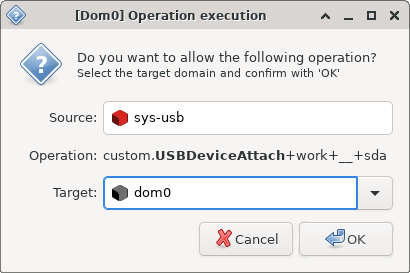


<span class='hidden'>$
\newcommand{\sysusb}{\textsf{sys-usb}}
\newcommand{\DomZ}{\textsf{Dom0}}
$</span>


I have been using [Qubes](https://www.qubes-os.org/intro/) as my primary OS[^qubes] for a while now,
and I am extremely happy with the level of control it provides me over my apps.
Recently someone raised an interesting question on the [Qubes OS forum](https://forum.qubes-os.org/):

> Hello,
>
> Is there a way to attach a particular USB device (by Vendor ID/Product ID)
> to a Qube automatically on connect? I have a sys-usb to manage USB devices.
>
> The USB device I am using frequently becomes disconnected (and reconnected) during use
> and it only needs to be connected to one particular Qube.
>
> Thanks,  
> N
>
> <p class='source' markdown=1><https://forum.qubes-os.org/t/usb-device-auto-attach-to-qube/5977></p>

<details markdown='1'>
<summary>But what exactly is $\sysusb$?</summary>
Typically, $\sysusb$ is a minimal VM to which all USB controllers are assigned.
So all USB devices are attached to $\sysusb$ when plugged in,
and not to $\DomZ$ that has direct access to rest of the hardware.
Attaching untrusted USB devices to $\DomZ$ is a potentially fatal security risk.
Many ready-to-use implementations of common attacks already exist,
e.g. the USB [Rubber Ducky].
Therefore, it's strongly recommended to use a dedicated USB VM,
and only [passthrough](https://wiki.xenproject.org/wiki/Xen_USB_Passthrough) trusted devices to VMs that need to access them.

Below are some excellent resources
on understanding the rationale behind using $\sysusb$:
- [Qubes OS documentation on device security](https://www.qubes-os.org/doc/device-handling-security/#usb-security)
- [Qubes OS documentation on USB qubes](https://www.qubes-os.org/doc/usb-qubes/)
- [Discussion on Qubes OS Forum](https://forum.qubes-os.org/t/what-is-the-purpose-of-sys-usb-if-using-a-usb-keyboard)

Also note that running applications, such as your password manager etc.
directly in $\sysusb$ defeats the whole point of using Qubes OS ---
_compartmentalization_.
A malicious USB device, if connected,
could potentially extract all of your application data.
So, $\sysusb$ should only be used as a handler,
and only _trusted_ devices should be connected to application VMs
(called _AppVMs_ in Qubes).
</details>

I have wondered about this sort of automation before.
I have a bunch of USB devices: external disks, crypto wallets,
password managers, etc.
which I attach to specific VMs immediately after plugging in.
It would be nice to be able to attach trusted devices to certain VMs automatically.

On a "regular" OS, such as [Debian] or [Fedora],
triggering actions on connecting / disconnecting USBs devices
is typically achieved using [udev] rules.
We could match on the Vendor ID / Model ID etc.
to detect when a particular USB device is added or removed,
and may `RUN` a desired script on that event.
However, this isn't as straightforward with $\sysusb$ on Qubes OS,
since it typically would have no access to other running VMs
and cannot attach devices to them directly.

<div>
# =fa^skull-crossbones^fa= POTENTIAL SECURITY RISK =fa^skull-crossbones^fa=

Before trying out the proposed changes on your system,
please remember that we are _sacrificing security for convenience_.
If implemented incorrectly, or without proper constraints,
you might end up unintentionally attaching potentially harmful devices to your VMs **automatically**!
</div>
{: .focus-box .color-accent }

I proposed an initial idea on how this could be done,
and this weekend I finally had some time to try it out &#x1F642;
The high-level plan is outlined below:

1. Since $\sysusb$ cannot escape virtualization
   and directly attach devices to other VMs,
   we must somehow communicate via the _AdminVM_ (i.e., $\DomZ$),
   which has access to all VMs.
2. Communication in Qubes typically happens using an elegant [remote procedure call (RPC)][RPC] framework,
   called [Qrexec], so we must write some new Qrexec service
   that receives a device attachment request and fulfills it.
3. Our Qrexec service will be listening in $\DomZ$,
   and a $\sysusb$ client must pass the target VM name and device name to this service from a udev trigger.
4. Finally, we must also setup an appropriate [Qrexec policy]
   for this service in $\DomZ$.

If you are unsure of what RPC / Qrexec / udev are,
then I would strongly suggest familiarizing yourself with those tools first
before making any changes to your system.

<div>
# =fa^exclamation-triangle^fa= ADVANCED QUBES / LINUX STUFF =fa^exclamation-triangle^fa=

**DO NOT** copy-paste any code or shell commands from the internet,
unless you understand exactly what they do.
You may compromise the security of your system, or damage it otherwise.
</div>
{: .focus-box .color-warning }


#### =fa^user-lock^fa= Changes in $\DomZ$

There are two main changes necessary in $\DomZ$:  
(a) a new Qrexec service to listen to device attachment requests from $\sysusb$,  
(b) a Qrexec policy to restrict the source and destination VMs for calls to this service.

##### The Qrexec Service

First, let's start with the new Qrexec service that would handle requests from $\sysusb$.
I am only going to describe how to automatically attach [block devices],
but attaching full USB devices is very similar
(see comment at the end of this section).

There are a few different ways of implementing this service.
One important choice to make is
regarding the mode of communication with $\sysusb$.
Only stdin/stdout is passed between the Qrexec server and client ---
in particular, there is no support for command-line arguments in Qrexec.
However, instead of communicating over stdin/stdout,
I chose to use a _service argument_,
which is actually passed as a single _command-line argument_ to the service.
A service argument, unlike stdin/stdout communication,
is visible on the $\DomZ$ prompt, so the communication is a bit more transparent.
Moreover the service argument is also *sanitized* by Qrexec,
before being supplied to the script.

However, since Qrexec only allows a single service argument currently,
we must _pack_ our target VM name and device name together.
An example prompt from my $\sysusb$ should be displayed below.
`custom.USBDeviceAttach` is the service that we are going to create,
and `work+__+sda` is the service argument.
In this case, I pack the target VM name (`work`)
and block device name (`sda` within $\sysusb$)
together by concatenating both using `+__+`.

<figure>
  
  <figcaption>
    A $\DomZ$ prompt showing argument <code>work+__+sda</code> for <code>custom.USBDeviceAttach</code> Qrexec call.
  </figcaption>
</figure>

The service script itself is pretty simple, as I show below.

```bash

```
{: .line-numbers }

To make it available to Qrexec as a new service,
this script must exist under `/etc/qubes-rpc` and must be marked as executable (`chmod +x`).
I used `/etc/qubes-rpc/custom.USBDeviceAttach`, for instance.

As mentioned before,
tweaking this script to work for full USB passthrough is easy ---
the `qvm-block` in line 20 could be changed to `qvm-usb`.
However, full USB passthrough is less secure.

##### The Qrexec Policy

For each Qrexec service,
we must also specify a Qrexec policy to whitelist calls from specific VMs.
In this case, we want to allow $\sysusb \rightarrow \DomZ$ calls,
and deny all other calls:

```text 
sys-usb dom0 ask,default_target=dom0

@anyvm @anyvm deny
```

If you have multiple USB qubes,
perhaps with different USB controllers assigned to each one,
you might create copies of the first line and modify accordingly.
The last line prevents all other (non-USB) qubes from triggering this Qrexec call.

This file should exist under `/etc/qubes-rpc/policy`,
and must have the same name as the service file.
I used `/etc/qubes-rpc/policy/custom.USBDeviceAttach`, for instance.

The `ask` in the first line could be changed to `allow` to skip the $\DomZ$ prompt,
and allow all requests from $\sysusb$,
but beware that this is a significant security risk.
A compromised $\sysusb$ may request $\DomZ$
to attach potentially harmful devices to arbitrary VMs,
and these requests would be fulfilled without without any user approval!


#### =fab^usb^fa= Changes in $\sysusb$

Finally, in $\sysusb$ we need to trigger our new Qrexec service
when USB devices are connected to automatically attach them to desired VMs.
But, before automating this process with udev,
we should first manually test the RPC by running:

```console
qrexec-client-vm dom0 custom.USBDeviceAttach+my-vm+__+sda
```

where $\textsf{sda}$ should be a block device (e.g., `/dev/sda`) in $\sysusb$,
and $\textsf{my-vm}$ should be some target VM.
If everything has been setup correctly,
$\DomZ$ should display a prompt, similar to one in my screenshot above.
On approving this request in $\DomZ$,
the device should be correctly attached to the target VM,
which can be checked by running `qvm-block` in $\DomZ$.

If everything works correctly,
then this Qrexec call could be automated via a udev rule in $\sysusb$.
As an example,
I have the following rule in a new file `/etc/udev/rules.d/50-auto-attach.rules`:

```udev
ACTION=="add", SUBSYSTEM=="block", KERNEL=="sd[a-z]", \
RUN+="/bin/sh -c 'qrexec-client-vm dom0 custom.USBDeviceAttach+my-vm+__+%k &'"
```

This rule will match new block devices with kernel names matching `sd[a-z]` regex,
so partitions such as `sda1` etc. wouldn't match this rule.
Upon a successful match, the `RUN` command is executed,
and $\DomZ$ is requested to attach the device to $\textsf{my-vm}$.
Beware that this rule is not very secure and must be constrained
with additional `ATTRS` or `ENV` values of the particular device to match on.
[An introduction to Udev](https://opensource.com/article/18/11/udev) is an excellent quick tutorial on this topic.

##### Unblocking udev

Observe that the `RUN` command has an `&` at the end,
and thus runs in a detached shell.
This is not a performance optimization,
but is _necessary_ to resolve a dependency cycle:

1. udev stays blocked on `RUN` scripts ---
   a USB device is connected and available in $\sysusb$ only after this script terminates
2. However, the Qrexec call triggered by the run script
   expects the device to already be available in $\sysusb$,
   and attempts to attach it to $\textsf{my-vm}$!

To resolve this dependency cycle,
we run the Qrexec call in a detached shell and unblock udev.
By the time $\DomZ$ processes the RPC,
receives user approval (via the prompt),
and attempts to attach the USB device to another VM,
udev should have finished connecting the device (usually instantaneous).

This (using `&`) is not the _correct_ way to detach scripts from udev.
There are multiple threads online regarding this, e.g., see:
[this StackOverflow thread](https://stackoverflow.com/questions/49349712/udev-detach-script-to-wait-for-mounting),
[this AskUbuntu thread](https://askubuntu.com/questions/667922/udev-script-doesnt-run-in-the-background),
and [this blogpost](https://bkhome.org/news/202012/how-to-run-long-time-process-on-udev-event.html).
However, this approach suffices for our case, because
Qrexec does not require the client to stay alive after making the RPC.
So although udev would kill the detached script after connecting the USB devices,
$\DomZ$ would have received the call and would carry out the requested operation.
$\DomZ$ might show a warning popup if the client is killed
before $\DomZ$ finishes attaching the device and returns a success code to client:

<figure>
  
  <figcaption>
    A $\DomZ$ warning shown if the client is killed
    before $\DomZ$ returns a success code.
  </figcaption>
</figure>

However, this warning is completely harmless.
Any of the solutions proposed in the above threads could be implemented
to properly detach the script and get rid of the warning.


##### Persistent udev Rules

Typically $\sysusb$ is an application VM (called _AppVM_ in Qubes).
Since the root filesystem for AppVMs is discarded on shutdown and reset to the corresponding _TemplateVM_ root filesystem,
the new rules saved under `/etc/udev/rules.d/` would not persist across reboots.
Therefore, the `50-auto-attach.rules` file should be saved in the AppVM persistent storage (within `/rw`),
and must be loaded into udev during boot.
For instance, I have saved it at `/rw/config/50-auto-attach.rules` and have the following in my `/rw/config/rc.local` init script:

```bash
cp /rw/config/*.rules /etc/udev/rules.d/

udevadm control --reload-rules && udevadm trigger
```

Furthermore, for [persistent DispVM $\sysusb$ configuration][persistence],
the changes above must be made in the DispVM template, and not $\sysusb$ directly.


[^qubes]: IMO, [Qubes] is more like a hypervisor (runs [Xen]) than an OS.
          The main Qubes "OS" (the $\DomZ$ in [Xen])
          is only responsible for managing several "regular" OSes
          within virtual machines (VMs).
          These VMs (and not the $\DomZ$) run the end-user apps.


[block devices]:  https://en.wikipedia.org/wiki/Device_file#Block_devices
[persistence]:    https://www.qubes-os.org/doc/disposable-customization/#create-custom-sys-net-sys-firewall-and-sys-usb-disposables
[Qrexec]:         https://www.qubes-os.org/doc/qrexec/
[Qrexec policy]:  https://www.qubes-os.org/doc/qrexec/#policy-files
[RPC]:            https://en.wikipedia.org/wiki/Remote_procedure_call
[Rubber Ducky]:   https://shop.hak5.org/products/usb-rubber-ducky-deluxe
[udev]:           https://en.wikipedia.org/wiki/Udev
