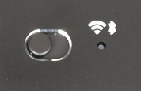


<span class='hidden'>$
\newcommand{\DomZ}{\textsf{Dom0}}
\newcommand{\sysnet}{\textsf{sys-net}}
\newcommand{\sysusb}{\textsf{sys-usb}}
$</span>


[Purism]'s [Librem 14] is an excellent laptop.
There were a few initial hiccups back when it was launched in 2020:
[buggy keymap], [fan noise], and battery issues
([constant discharge] and/or [crashes]).
However, all of these issues were fully resolved by quick firmware updates,
and I currently have _zero_ hardware issues with my laptop.
I must admit, after reading the reviews for its predecessors: L13 and L15,
both of which are now discontinued, I was a bit skeptical of buying the L14.
However, I do now feel quite happy that I pulled the trigger on L14.
It's an impressive device and with 64&thinsp;GB memory, it's perfect for running [Qubes].
So, huge kudos to the Purism team for their excellent Librem devices!

The L14 exposes a number LEDs that can be controlled by software,
via the Librem embedded controller (EC) driver.
The [L14 Rave blog post] provides an excellent high-level overview of these LEDs.
Since the EC driver comes preinstalled only in Purism's own [Pure OS] distribution,
as of now, it must be manually installed in Qubes.
Installing the L14 EC driver in $\DomZ$ is pretty straightforward,
and the exact steps can be found on [the Purism forum][EC installation].
Although the EC driver makes Qubes aware of these LEDs,
controlling them from user applications, however, is somewhat tricky.

<figure>
  
  <figcaption>
    The array of LEDs on Purism's Librem 14 laptop.
  </figcaption>
</figure>

Typically the $\DomZ$ in Qubes doesn't run anything interesting.
One might actually want to control the LEDs from some other VMs,
such as $\sysnet$ which typically controls the networking devices (WiFi and Ethernet),
or $\sysusb$ which  typically controls the USB hub(s).
In [a previous post](../2021-09_usb-autoattach-in-qubes),
I discuss more about Qubes and these various VMs,
so interested readers are welcome to check it out.
Since we don't want the LEDs to only be available to a single VM,
[passthrough or attaching] the LEDs to a VM is not an option ---
I am actually not sure if that's even possible for non-PCI devices.

So, since a VM that needs to trigger these LEDs won't have direct access to the hardware,
it must access them _via_ $\DomZ$.
Within Qubes, this sort of communication typically happens
using an elegant [remote procedure call (RPC)][RPC] framework called [Qrexec].
If you are unsure of what RPC / Qrexec are,
then I would strongly suggest familiarizing yourself with those tools first
before making any changes to your system.

I will be explaining a particular RPC
for controlling the wireless (WiFi/Bluetooth) LED, `/sys/class/leds/librem_ec:airplane`.
The techniques for controlling the notification LED are very similar,
but the RGB channels for it are exposed separately as
`/sys/class/leds/{blue,green,red}:status`.
As opposed to `librem_ec:airplane`, which accepts a binary value,
these RGB channels accept decimal values between `0` and `255`.

<div>
# =fa^exclamation-triangle^fa= ADVANCED QUBES / LINUX STUFF =fa^exclamation-triangle^fa=

**DO NOT** copy-paste any code or shell commands from the internet,
unless you understand exactly what they do.
You may compromise the security of your system, or damage it otherwise.
</div>
{: .focus-box .color-warning }


#### =fa^user-lock^fa= Changes in $\DomZ$

There are two main changes necessary in $\DomZ$:  
(a) a new Qrexec service to listen to LED trigger requests from AppVMs,  
(b) a Qrexec policy to restrict which VMs may call this service.

##### The Qrexec Service

First, let's start with the new Qrexec service that would handle requests
for triggering the `librem_ec:airplane` LED.
The script itself is pretty straightforward, as I show below.

```bash

```
{: .line-numbers }

The service accepts a single argument, which may either be `up` or `down`,
and sets the brightness of the the `librem_ec:airplane` LED accordingly.
Note that, the EC uses the LED to indicate if the laptop is in "[airplane mode],"
i.e. "on" when WiFi is disconnected and "off" when WiFi is connected.

<figure>
  
  <figcaption>
    The WiFi/Bluetooth LED on the Librem 14.
  </figcaption>
</figure>

But, that just didn't make sense to me ---
when I physically turn off the hardware by flipping the switch next to it,
then WiFi is disconnected but the LED stays "off," as there is no power supply to it.
Furthermore, the label over the LED makes it look (to me) more like
a wireless connection indicator, rather than an airplane mode indicator.

So, I chose the LED to be "on" when WiFi is connected, and "off" otherwise,
and I set the brightness as the inverse of the service argument ---
`0` brightness for `up` argument and `1` brightness for `down`.

To make it available to Qrexec as a new service,
this script must exist under `/etc/qubes-rpc` and must be marked as executable (`chmod +x`).
I used `/etc/qubes-rpc/custom.SetWiFiLED`, for instance.
We should be able to control the WiFi/Bluetooth LED now
by invoking this script in $\DomZ$.

```console
/etc/qubes-rpc/custom.SetWiFiLED up
/etc/qubes-rpc/custom.SetWiFiLED down
```
{: .command-line data-user="user" data-host="dom0" }

##### The Qrexec Policy

For each Qrexec service,
we must also specify a Qrexec policy to whitelist calls from and to specific VMs.
In this case, we want to allow $\sysnet \rightarrow \DomZ$ calls,
and deny all other calls:

```text 
sys-net dom0 allow

@anyvm @anyvm deny
```
{: .line-numbers }

Note that we used `allow` and not `ask` in the first line
to skip a $\DomZ$ prompt each time the RPC is invoked.

The policy file should exist under `/etc/qubes-rpc/policy`,
and must have the same name as the service file.
I used `/etc/qubes-rpc/policy/custom.SetWiFiLED`, for instance.

#### =fa^network-wired^fa= Changes in $\sysnet$

Finally, in $\sysnet$ we want to trigger our new Qrexec service
when WiFi is connected or disconnected.
But, before automating this trigger,
we should first manually test the RPC by running :

```console
qrexec-client-vm dom0 custom.SetWiFiLED+up
qrexec-client-vm dom0 custom.SetWiFiLED+down
```
{: .command-line data-user="user" data-host="sys-net" }

Notice that in Qrexec, the name and the argument for a service are passed together,
delimited by a `+`.

If the Qrexec calls execute without errors,
and the WiFi/Bluetooth LED toggles as expected,
then we may now automate this Qrexec call.

One way to trigger this Qrexec call on WiFi state change
is to use the [NetworkManager-dispatcher] service. 
As an example, I have the following hook
in a new file `/etc/NetworkManager/dispatcher.d/99-librem-wifi-led`:

```bash

```
{: .line-numbers }

The script essentially checks if the interface that has changed state
is a WiFi interface (prefixed with `wls` in Fedora),
and then makes the Qrexec call with if the new state.
States other than `up` and `down`, such as `pre-up`, `dhcp4-change` etc.
are ignored.
The script should be effective immediately, without any restarts.


[constant discharge]:     https://forums.puri.sm/t/l14-battery-constant-discharge-charge-in-qubes
[buggy keymap]:           https://forums.puri.sm/t/insert-key-does-not-work
[crashes]:                https://forums.puri.sm/t/librem-14-sudden-crash-when-unplugged
[fan noise]:              https://forums.puri.sm/t/how-to-reduce-annoying-fan-noise

[Airplane mode]:          https://en.wikipedia.org/wiki/Airplane_mode
[passthrough or attaching]: https://www.qubes-os.org/doc/how-to-use-devices/#attaching-devices
[EC installation]:        https://forums.puri.sm/t/l14-battery-constant-discharge-charge-in-qubes/13643/29
[L14 Rave blog post]:     https://puri.sm/posts/librem-14-rave/
[Librem 14]:              https://puri.sm/products/librem-14/
[NetworkManager-dispatcher]: https://man.archlinux.org/man/NetworkManager-dispatcher.8.en
[Pure OS]:                https://pureos.net/
[Purism]:                 https://puri.sm/
[Qrexec]:                 https://www.qubes-os.org/doc/qrexec/
[RPC]:                    https://en.wikipedia.org/wiki/Remote_procedure_call
[Qubes]:                  https://www.qubes-os.org/
