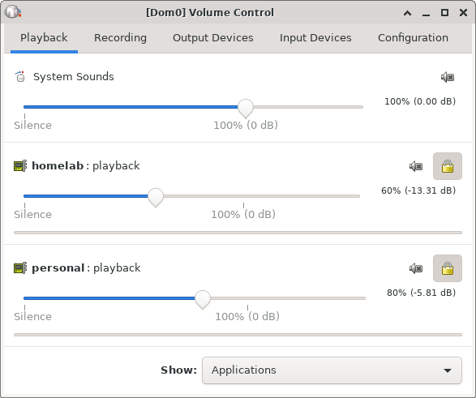


<span class='hidden'>$
\newcommand{\DomZ}{\textsf{Dom0}}
\newcommand{\MyAppVM}{\textsf{my-appvm}}
$</span>


What really excites me about [Qubes OS],
is its core principle of _security by compartmentalization_,
built (not retrofitted) into an operating system that is not only fully auditable,
but is also quite user friendly.
As with devices, networks, and storage,
audio in Qubes OS is also compartmentalized using _virtualization_.
In Qubes OS, each running AppVM, that has `pulseaudio-qubes` installed within its template,
shows up in $\DomZ$'s [PulseAudio] server as an _input_.[^pipewire]
Although the PulseAudio volume control ([`pavucontrol`][pavucontrol])
in $\DomZ$ GUI is useful for adjusting the audio volume for each AppVM,
there's no convenient CLI for doing so.

<figure id='pavucontrol'>
  
  <figcaption>
    <code>pavucontrol</code> in Qubes displaying the running AppVMs and their audio volume.
  </figcaption>
</figure>

Having a simple command or script to change AppVM volume,
or toggle mute state on a particular AppVM,
would be useful to assign keyboard shortcuts, for example.
In this post, I will detail a couple of scripts that I personally use,
which leverage the [`pactl`](https://www.freedesktop.org/wiki/Software/PulseAudio/Documentation/User/CLI/#pactl)
CLI utility from PulseAudio.


#### =fa^volume-high^fa= PulseAudio in Qubes OS

But before diving into the technical details,
let's take a look at the Qubes OS audio virtualization setup
to understand how audio is routed from the virtual machines to hardware devices.



Interested readers may dive into a lot more details on Qubes' [audio virtualization] doc,
but essentially Qubes defines a restricted protocol for VMs to communicate audio streams with the $\DomZ$,
to which the speakers and microphones are _actually_ connected.[^audiovm]
The `Lavender`{: .transparent .language-css } boxes in the figure above indicate virtualized components,
and the `MistyRose`{: .transparent .language-css } ones indicate non-virtualized ones.
Qubes OS creates virtualized I/O end points in $\DomZ$, virtualized sources and sinks in AppVMs,
and establishes a simple, highly restricted protocol between them.
The solid arrows indicate the usual intra-VM routing of audio streams by PulseAudion,
and the dotted lines indicate the Qubes-specific communication protocol between the virtualized components.
In this post, we are interested in the specific audio route
that is highlighted in `Magenta`{: .transparent .language-css } ---
the routing of an audio stream from an AppVM application to a hardware sink in $\DomZ$.

<details>
<summary>What are these sinks, inputs etc. in PulseAudio?</summary>
<div class='pure-g'>
  <div class='pure-u-1-1 pure-u-sm-1-2 pure-u-lg-2-5'>
  
  </div>
  {: style="margin-bottom: -2em;" }
  <div class='pure-u-1-1 pure-u-sm-1-2 pure-u-lg-3-5'>
  PulseAudio can be thought of as a [mixing console](https://en.wikipedia.org/wiki/Mixing_console),
  that is responsible for routing audio streams between:
  - **Input**: Program that generates audio streams.
               <br class='visible-above-large'> Example: audio player
  - **Output**: Program that consumes audio streams.
                <br class='visible-above-large'> Example: voice recorder
  - **Source**: Device that generates audio streams.
                <br class='visible-above-large'> Example: microphone
  - **Sink**: Device that consumes audio streams.
              <br class='visible-above-large'> Example: speakers
  </div>
  {: style="margin-bottom: -1em;" }
</div>

Audio is typically routed from _input_ to _sink_ (the `Magenta`{: .transparent .language-css } path),
or from _source_ to _output_ (the `Blue`{: .transparent .language-css } path).

`pactl` provides the `list` subcommand to inspect these components:
- `pactl list sources` shows the connected audio sources 
- `pactl list sinks` shows the connected audio sinks
- `pactl list source-outputs` shows the active audio receivers and the sources they are connected to
- `pactl list sink-inputs` shows the active audio generators and the sinks they are connected to
</details>

With a basic understanding of Qubes OS' audio virtualization setup,
we can now compare different strategies for achieving our goal ---
a CLI to adjust the volume from audio originating from an AppVM.
Since we have PulseAudio running both in $\DomZ$ and in our AppVM,
we have two choices:

- adjust volume along the input $\longrightarrow$ virtual sink path in AppVM, or
- adjust volume along the virtual input $\longrightarrow$ sink path in $\DomZ$.

Both of these approaches are valid, and are similar in terms of implementation burden.
Below is a high-level analysis of the pros and cons of each one.

<div>
# =fa^exclamation-triangle^fa= ADVANCED QUBES / LINUX STUFF =fa^exclamation-triangle^fa=

**DO NOT** copy-paste any code or shell commands from the internet,
unless you understand exactly what they do.
You may compromise the security of your system, or damage it otherwise.
</div>
{: .focus-box .color-warning }

##### Input $\longrightarrow$ Virtual Sink

In this approach, we would use `pactl` in the AppVM to set the (virtual) sink volume:

```bash
pactl set-sink-volume 0 <volume>%
```
{: .command-line data-user="user" data-host="my-appvm" }

The target sink number is `0` since the AppVM should have a single sink ---
a virtual sink created by Qubes OS.
The `<volume>` parameter is the desired volume level between `0` and `100` (both inclusive).

To bind keyboard shortcuts, or control volume from $\DomZ$ automation scripts,
however, we must issue the command above from $\DomZ$.
Fortunately, this is easily achieved using `qvm-run` in Qubes OS:

```bash
qvm-run my-appvm 'pactl set-sink-volume 0 <volume>%'
```
{: .command-line data-user="user" data-host="dom0" }

Instead of setting the volume for AppVM's (virtual) sink,
which affects the volume from all inputs from the AppVM,
we may choose to adjust the volume for a particular input $\longrightarrow$ virtual sink path.

```bash
qvm-run my-appvm 'pactl set-sink-input-volume <N> <volume>%'
```
{: .command-line data-user="user" data-host="dom0" }

The target sink-input number `<N>` would depend on the number of audio-playing applications in the AppVM.
`pactl` can be used to query the active sink-input paths, for example:

```bash
qvm-run --pass-io my-appvm 'pactl list sink-inputs | grep -e \# -e Sink: -e Volume: -e process.host -e process.binary'
Sink Input #3
        Sink: 0
        Volume: front-left: 65536 / 60% / 0.00 dB,   front-right: 65536 / 60% / 0.00 dB
                application.process.host = "my-appvm"
                application.process.binary = "firefox-esr"
Sink Input #4
        Sink: 0
        Volume: front-left: 65536 / 100% / 0.00 dB,   front-right: 65536 / 100% / 0.00 dB
                application.process.host = "my-appvm"
                application.process.binary = "spotify"
```
{: .command-line data-user="user" data-host="dom0" data-output="2-11" }

So executing,

```bash
qvm-run my-appvm 'pactl set-sink-input-volume 3 100%'
```
{: .command-line data-user="user" data-host="dom0" }

would raise the volume of the audio stream from Firefox to the virtual sink in $\MyAppVM$.

So far so good!
But there is one subtle issue in monitoring volume from $\DomZ$.
The changes to sink volume and sink-input volume are local to the AppVM.
Although the virtual sink in an AppVM is connected to the virtual input in $\DomZ$,
changing the volume of one doesn't affect the other.
For example:

```bash
qvm-run --pass-io my-appvm 'pactl set-sink-volume 0 50%'
qvm-run --pass-io my-appvm 'pactl list sinks | grep -e \# -e Volume:'
Sink #0
	Volume: front-left: 50 /   0% / -187.05 dB,   front-right: 50 /   0% / -187.05 dB
	Base Volume: 65536 / 100% / 0.00 dB
pactl list sink-inputs | grep -e \# -e Volume: -e application.name\ =
Sink Input #0
	Volume: front-left: 65536 / 100% / 0.00 dB,   front-right: 65536 / 100% / 0.00 dB
		application.name = "homelab"
Sink Input #1
	Volume: front-left: 65536 / 100% / 0.00 dB,   front-right: 65536 / 100% / 0.00 dB
		application.name = "my-appvm"
Sink Input #2
	Volume: front-left: 65536 / 100% / 0.00 dB,   front-right: 65536 / 100% / 0.00 dB
		application.name = "work"
```
{: .command-line data-user="user" data-host="dom0" data-output="3-5,7-15"}

Notice that the sink 0 volume in $\MyAppVM$ is at 50%,
but the sink-input 1 volume in $\DomZ$ is at 100%.
Of course, we could run `qvm-run` across all running AppVMs and `pactl` in $\DomZ$,
multiply the sink volumes from AppVMs with the corresponding sink-input volume in $\DomZ$,
merge the output into some readable format ...
but it's just not convenient.
The situation gets even more complicated
if we adjust volume on individual sink-input paths within AppVMs.
It maybe quite confusing and frustrating to debug unexpected volume levels from certain AppVMs,
or even certain applications within an AppVM.

In summary, we have the following trade off with this approach:
- **Pro:** Very fine-grained volume control over individual applications.
- **Con:** Difficult to monitor volume in $\DomZ$; may lead to confusion.

##### Virtual Input $\longrightarrow$ Sink

The second is to ignore the PulseAudio instances within AppVMs,
and only adjust per-AppVM volume within $\DomZ$.
This is very similar to setting per-application volume within an AppVM ---
each AppVM looks like an _application_ to $\DomZ$'s PulseAudio.

So executing,

```bash
pactl list sink-inputs | grep -e \# -e Volume: -e application.name\ =
Sink Input #0
	Volume: front-left: 65536 / 100% / 0.00 dB,   front-right: 65536 / 100% / 0.00 dB
		application.name = "homelab"
Sink Input #1
	Volume: front-left: 65536 / 100% / 0.00 dB,   front-right: 65536 / 100% / 0.00 dB
		application.name = "my-appvm"
Sink Input #2
	Volume: front-left: 65536 / 100% / 0.00 dB,   front-right: 65536 / 100% / 0.00 dB
		application.name = "work"
pactl set-sink-input-volume 1 50%
```
{: .command-line data-user="user" data-host="dom0" data-output="2-10"}

would drop the volume of the audio stream from $\MyAppVM$ to 50%.
Not only is this change reflected on `pactl list sink-inputs`,
but is also visible on $\DomZ$'s [`pavucontrol`][pavucontrol] GUI.

Of course, we would also adjust the global volume for a sink using:

```bash
pactl set-sink-volume <N> <volume>%
```
{: .command-line data-user="user" data-host="dom0" }

The target sink number `<N>` is typically `0` (on systems with a single audio output device).

There isn't much more to say about this approach,
just that we sacrifice some granularity in volume adjustment
for some convenience in monitoring.
In summary, we have the following trade off:
- **Pro:** Easy to monitor per-AppVM volume in $\DomZ$, via `pavucontrol`.
- **Con:** Coarse-grained control, over per-AppVM sinks, not per application.


#### =fa^user-lock^fa= Implementation in $\DomZ$

Based on these tradeoffs in mind, I decided to go with the second approach.
Being able to set per-AppVM volume from a CLI is enough for my current use cases.
In the remainder of this post, I will list the scripts that I use with this approach.

Unfortunately, `pactl` does not generate a [machine-friendly] output,
for example in XML or JSON or CSV.
So, in the scripts below, I first format the output from `pactl`.
Here is an example of this formatting:

```bash
pactl list sink-inputs | grep -e \# -e Volume: -e application.name\ =
Sink Input #0
	Volume: front-left: 65536 / 100% / 0.00 dB,   front-right: 65536 / 100% / 0.00 dB
		application.name = "homelab"
Sink Input #1
	Volume: front-left: 65536 / 100% / 0.00 dB,   front-right: 65536 / 100% / 0.00 dB
		application.name = "my-appvm"
Sink Input #2
	Volume: front-left: 65536 / 100% / 0.00 dB,   front-right: 65536 / 100% / 0.00 dB
		application.name = "work"
SI="$(pactl list sink-inputs)"
paste -d';' <( printf '%s' "$SI" | grep 'application.name =' | cut -d'"' -f2 ) \
            <( printf '%s' "$SI" | grep 'Sink Input #' | cut -d'#' -f2 )
homelab;0
my-appvm;1
work;2
```
{: .command-line data-user="user" data-host="dom0" data-output="2-10,14-16" data-line="11-13" }

This formatting allows me to operate on a CSV-ish (`;`-separated) output,
in place of an unstructured text dump.

##### Volume Control

This first script, which I have saved as `qvm-audio-volume`,[^qvm-volume]
can be used to set the volume of one or more AppVMs.
For example:

```bash
qvm-audio-volume 50 my-appvm work
```
{: .command-line data-user="user" data-host="dom0" }

would set the volume of audio streams from $\MyAppVM$ and $\textsf{work}$ to 50%.

The script is listed below:

```bash

```
{: .line-numbers }

A couple of interesting bits about the script:

- In the inner loop in lines 10 -- 13,
  we iterate over the AppVM names that match each `$pattern`
  that is an argument to the script.
  This allows me to easily adjust volume for a set of AppVMs,
  say all VPN-connected AppVMs that are named $\textsf{vpn-}\ast$,
  by just invoking `qvm-audio-volume 20 vpn`.
- In line 6, the default value of `$volume` is set to `100`,
  and in line 7, the default value of the remaining arguments (`$@`) is set to `;`,
  which is essentially an empty pattern that matches all AppVMs.
  This allows me to do things like:
  -  reset the volume of all running AppVMs, by invoking `qvm-audio-volume`, and
  -  reduce the volume of all running AppVMs, by invoking `qvm-audio-volume 80`.

Instead of setting the volume to an absolute value,
it's also possible to change it relatively by specifying `+` or `-` in front.
For example:

```bash
qvm-audio-volume +10 my-appvm work
```
{: .command-line data-user="user" data-host="dom0" }

would increase the volume of audio streams from $\MyAppVM$ and $\textsf{work}$ by 10%.

##### Mute & Unmute

The second script, which I have saved as `qvm-audio-mute`,
can be used to set or unset the mute state of one or more AppVMs.
For example:

```bash
qvm-audio-mute 1 my-appvm work
qvm-audio-mute 0 homelab
```
{: .command-line data-user="user" data-host="dom0" }

would mute the audio streams from $\MyAppVM$ and $\textsf{work}$,
and unmute the audio stream from $\textsf{homelab}$.

The script is listed below:

```bash

```
{: .line-numbers data-line="12"}

This script is identical to the previous script,
except for the highlighted line which invokes `pactl` to set the mute state.
In line 6, the default value of `$mute` is set to `0`,
and in line 7, the default value of the remaining arguments (`$@`) is set to `;`.
This allows me to do things like:
- mute all running AppVMs, by invoking `qvm-audio-mute`, and
- unmute all running AppVMs, by invoking `qvm-audio-mute 0`.

##### Target Focused Window

I will conclude this post with a few scripts that use the two scripts above,
but target the AppVM that is running the currently focused window.
I find myself using all three of the following scripts quite heavily,
and I even have keyboard shortcuts for these.
The key idea is to use [`xdotool`][xdotool] utility to get information regarding
the active window, in particular the _window class name_.
Qubes OS sets the window class name for non-$\DomZ$ windows as: `<AppVM Name>:<Window Title>`,
so we use that (the prefix before `:`) to identify the AppVM running the active window.

This first script grabs the AppVM name from the currently focused window,
and raises the volume of audio streams from this AppVM by 10%.  
(_Keyboard shortcut_: <kbd>Shift</kbd> + <kbd>Volume Up</kbd>)

```bash
#!/usr/bin/env bash

vm="$(xdotool getactivewindow getwindowclassname | cut -d':' -f1)"

qvm-audio-volume +10 $vm
```
{: .line-numbers }

This second script grabs the AppVM name from the currently focused window,
and reduces the volume of audio streams from this AppVM by 10%.  
(_Keyboard shortcut_: <kbd>Shift</kbd> + <kbd>Volume Down</kbd>)

```bash
#!/usr/bin/env bash

vm="$(xdotool getactivewindow getwindowclassname | cut -d':' -f1)"

qvm-audio-volume -10 $vm
```
{: .line-numbers }

The third script grabs the AppVM name from the currently focused window,
and mutes all audio from all AppVMs except for the AppVM in focus.  
(_Keyboard shortcut_: <kbd>Shift</kbd> + <kbd>Audio Mute</kbd>)

```bash
#!/usr/bin/env bash

vm="$(xdotool getactivewindow getwindowclassname | cut -d':' -f1)"

qvm-mute
qvm-mute 0 $vm
```
{: .line-numbers }


[^audiovm]: [A dedicated audio domain](https://www.qubes-os.org/news/2020/03/18/gui-domain/#audio-domain)
            is being planned by the Qubes OS developers to further minimize the audio attack surface.
            This is still a work in progress, but I believe the solutions I describe in this post
            should translate easily to this configuration.

[^pipewire]: Qubes OS is going to eventually use [PipeWire](https://pipewire.org/) in place of PulseAudio.
             This is still a [work in progress](https://www.qubes-os.org/doc/releases/4.2/release-notes/) as of R4.2.

[^qvm-volume]: [`qvm-volume`][qvm-volume] is a Qubes OS system utility for volume and block device management.
               Be sure not to _shadow_ this utility; save the audio volume adjustment script with another name.


[audio virtualization]:   https://www.qubes-os.org/doc/audio-virtualization/
[machine-friendly]:       https://en.wikipedia.org/wiki/Machine-readable_medium_and_data#Data
[pavucontrol]:            https://freedesktop.org/software/pulseaudio/pavucontrol/
[PulseAudio]:             https://www.freedesktop.org/wiki/Software/PulseAudio/
[Qubes OS]:               https://www.qubes-os.org/
[qvm-volume]:             https://dev.qubes-os.org/projects/core-admin-client/en/latest/manpages/qvm-volume.html
[xdotool]:                https://github.com/jordansissel/xdotool
