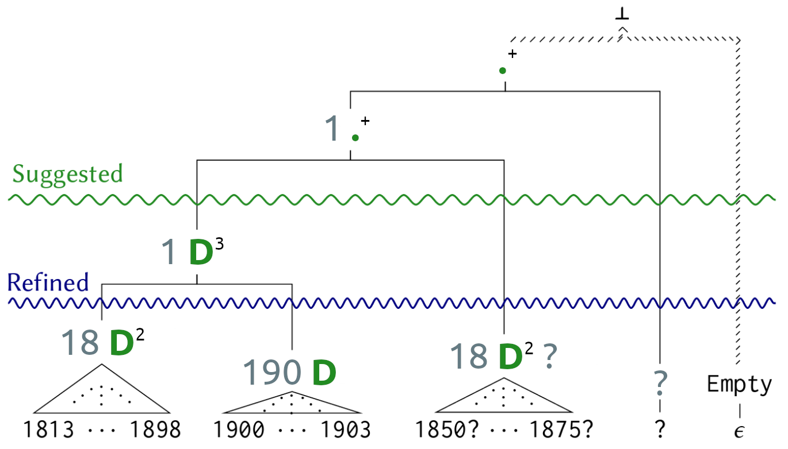
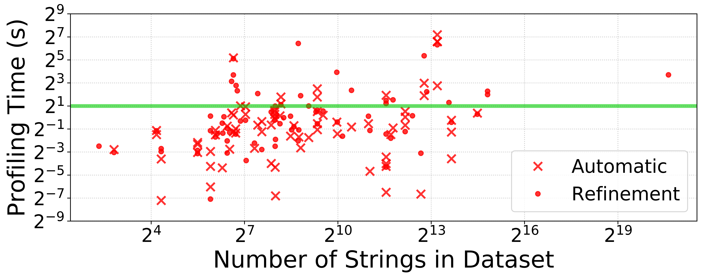
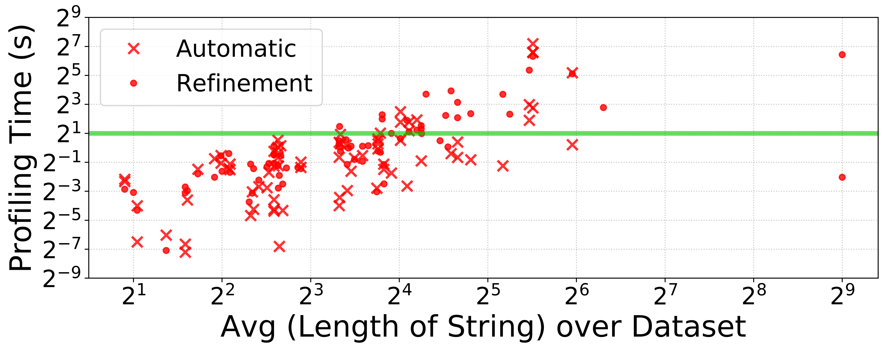
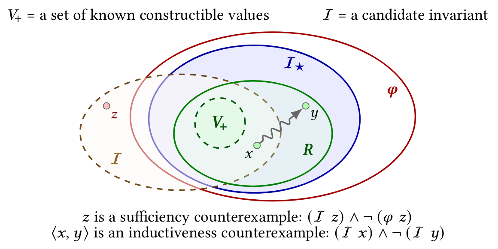
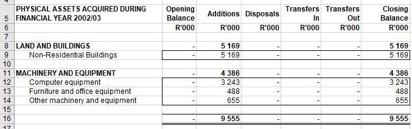
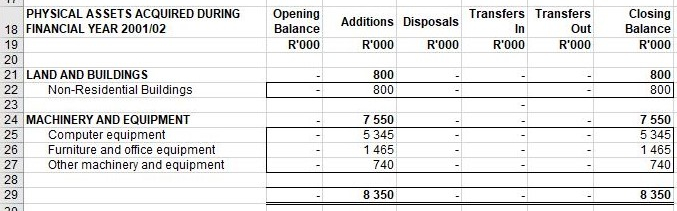

<section class='title-slide' data-transition='fade-in fade-out'>
### Data-Driven Learning of
{: style="margin-top:2em; font-size: 1.8em" }
### Invariants and Specifications
{: style="font-size: 1.8em" }




<br><br>

<span class='color-faded color-accent'>Saswat Padhi</span>
<p style='font-size:0.6em'>
  {: .plain style='margin:0; height:1.275em; vertical-align:bottom' }
  University of California, Los Angeles, USA
</p>

DISPLAY$
  \newcommand{\argmin}{\mathop{\text{arg}\,\text{min}}}
$DISPLAY
</section>


<section data-transition='fade-in slide-out'>
### Software Reliability

<div class='columns' style='font-size:0.85em; margin-top:0.75em'>
<div>
#### Research Artifacts
{: style='text-align:center'}



<div style='font-size:0.425em; padding:0.125em 0.5em 0.25em; text-align:justify; width:27rem'>
=fa^quote-left fa-xs superscript^fa=
[CompCert](http://compcert.inria.fr/)
is the only compiler we have tested for which
[Csmith](https://embed.cs.utah.edu/csmith/) cannot find wrong-code errors.
This is not for lack of trying:
we have devoted about six CPU-years to the task.
=fa^quote-right fa-xs superscript^fa=
<p style='text-align:right; font-size:0.8em'>
  &mdash; X. Yang et al.
  "[Finding and Understanding Bugs in C Compilers](https://dl.acm.org/doi/10.1145/1993316.1993532)."
  PLDI'11
</p>
</div>
{: .color-highlight .focus-box .fragment data-fragment-index='1' }
</div>
<div class='separator'></div>
<div>
#### Industrial Products
{: style='text-align:center'}



<div style='font-size:0.425em; padding:0.125em 0.5em 0.25em; text-align:justify; width:29rem'>
=fa^quote-left fa-xs superscript^fa=
This program is distributed in the hope that it will be useful,
but WITHOUT ANY WARRANTY;
without even the implied warranty of MERCHANTABILITY
or FITNESS FOR A PARTICULAR PURPOSE.
=fa^quote-right fa-xs superscript^fa=
<p style='text-align:right; font-size:0.8em'>
  &mdash; Disclaimer from
  the [GNU Public License (GPLv3)](https://www.gnu.org/licenses/gpl-3.0.en.html)
</p>
</div>
{: .color-accent .focus-box .fragment data-fragment-index='2' }
</div>
</div>

<div style='margin:1.75em 4.5em; font-size:0.55em; text-align:left'>
Code reviews, extensive testing, continuous integration/deployment (CI/CD),
reproducible builds, quality assurance (QA) &hellip;
<strong class='color-accent fragment' data-fragment-index='4'>
  Not enough!
</strong>
</div>
{: .fragment data-fragment-index='3' }

<div style='margin-top:1.25em; font-size:0.7em; width:85%'>
- What limits the adoption of software verification?
- How can we bridge this gap between research and practice?
{: style='margin:0.125em 0 0 -0.5em; line-height:1.375em'}
</div>
{: .color-medium-accent .focus-box .fragment data-fragment-index='5' }

<aside class='notes' markdown='1'>
  - The research community has produced fully verified prototypes of large systems
  - However, despite extensive testing, code review etc. major bugs are discovered
    regularly even in mature industrial products
  - My research was motivated by these two questions ...
</aside>
</section>


<section data-transition='slide-in fade-out'>
### Verification



<div style='margin:0.25em auto; font-size:0.8em'>
Stating these formal properties accurately <br>
is extremely onerous, even for experts
</div>
{: .color-accent .focus-box .fragment data-fragment-index='2' }

<div style='font-size:0.6em; margin:1.75em auto; text-align:justify; width:82.5%'>
=fa^quote-left fa-xs superscript^fa=
crafting a correct specification
(especially one using an obscure formal system)
is often <em class='color-faded color-accent'>much more difficult</em> than
writing the program to be proved
(even one written in an obscure programming language)
=fa^quote-right fa-xs superscript^fa=
<p style='text-align:right; font-size:0.7em'>
  &mdash; B. Hailpern et al.
  "[Software Debugging, Testing, and Verification](https://dl.acm.org/doi/10.1147/sj.411.0004)."
  IBM Systems Journal =qq= 02
</p>
</div>
{: .fragment data-fragment-index='3' }

<div style='margin:1em auto; font-size:0.8em'>
Existing tools provide little or no support
in generating correct specifications and invariants
</div>
{: .color-accent .focus-box .fragment data-fragment-index='4' }
</section>


<section data-transition='fade-in slide-out'>
### Research Focus



<div class='color-highlight focus-box'
     style='margin-top:0.25em; font-size:0.8em; width:85%'>
Drastically reduce the cost of building verified software
by **automated synthesis** of formal properties
</div>



<div style='position:absolute; left:2rem; top:43.75rem; font-size:1rem'>
  $^\star$
  inspired by two emergent techniques &mdash;
  CEGIS ([A. Solar-Lezama. STTT =qq= 13](https://doi.org/10.1007/s10009-012-0249-7))
  and SyGuS ([R. Alur et al. FMCAD =qq= 13](http://ieeexplore.ieee.org/document/6679385/))
</div>
{: .fragment data-fragment-index='3' }
</section>


<section>
### Overview of Projects

<div class='columns' style='font-size:0.825em; margin-top:0'>
<div>
#### Specification Synthesis
{: style='text-align:center'}

<div style='width:14em'>
##### _PIE_{:.small-caps}
<p class='annot'>[PLDI 2016]$\,^\star$</p>
<span style='font-size:0.825em'>
  Feature learning for black-box precondition inference
</span>
<div style='font-size:0.5em; margin:0.25em 0 -0.375em'>
  Adopted by _CVC4_{:.small-caps}, _Alive-Infer_{:.small-caps} (used by _LLVM_{:.small-caps})
</div>
{: .color-faded .color-accent }
</div>
{: .focus-box .color-highlight }

<div style='margin-top:0.875em; width:14em'>
##### _FlashProfile_{:.small-caps}
<p class='annot'>[OOPSLA 2018]</p>
<span style='font-size:0.825em'>
  Input specifications for <br> data-processing workflows
</span>
<div style='font-size:0.5em; margin:0.25em 0 -0.375em'>
  Released as part of Microsoft PROSE SDK&hairsp;[=fa^external-link-square-alt superscript^fa=][PROSE]
</div>
{: .color-faded .color-accent }
</div>
{: .focus-box .color-highlight }
</div>
<div>
#### Invariant Synthesis
{: style='text-align:center'}

<div style='width:14em'>
##### _LoopInvGen_{:.small-caps}
<p class='annot'>[PLDI 2016]$\,^\star$</p>
<span style='font-size:0.825em'>
  Feature learning for white-box loop invariant inference
</span>
<div style='font-size:0.5em; margin:0.25em 0 -0.375em'>
  Winning solver at SyGuS&hairsp;-&hairsp;Comp 2017, 2018
</div>
{: .color-faded .color-accent }
</div>
{: .focus-box .color-highlight }

<div style='margin-top:0.875em; width:14em'>
##### _Hanoi_{:.small-caps}
<p class='annot'>[PLDI 2020]</p>
<span style='font-size:0.825em'>
  Representation invariants for data-type implementations
</span>
<div style='font-size:0.5em; margin:0.25em 0 -0.375em'>
  Received an ACM SIGPLAN Distinguished Paper Award
</div>
{: .color-faded .color-medium-accent }
</div>
{: .focus-box }
</div>
</div>

<div style='font-size:0.75em; margin-top:0.875em; width:45%'>
##### Overfitting in Synthesis
<p class='annot'>[CAV 2019]</p>
<span style='font-size:0.85em'>
  Mitigating a fundamental trade-off in data-driven synthesis
</span>
</div>
{: .focus-box .color-highlight }

<div style='position:absolute; left:2rem; top:43.75rem; font-size:1rem'>
  $^\star$ presented in the same PLDI 2016 paper
</div>
</section>


<section data-transition='slide-in fade-out'>
### _FlashProfile_{:.small-caps}

<p class='subheading' style='margin:-0.75em 0 0 0.125em; font-size:0.575em'>
  <span class='color-faded color-medium-accent'>S. Padhi</span>,
  P. Jain,
  D. Perelman,
  O. Polozov,
  S. Gulwani,
  T. Millstein
  **&middot;**
  **[OOPSLA 2018]**
  **&middot;**
  {: .plain style='margin:0 0 0.125em 0.05em; height:1em; vertical-align:bottom' }
  {: .plain .color-faded style='margin:0 0 0.125em 0.05em; height:1em; vertical-align:bottom' }
</p>

<div style='font-size:0.7em; position:absolute; top:8rem; left:18.5rem; width:15em'>
Real-life datasets are often
incomplete and inconsistent
</div>
{: .focus-box .color-accent }



<div style='position:absolute; font-size:1.45em; top:20.875rem; left:29.75rem'>
=fa^user^fa=
</div>
{: .color-medium-accent }

<table class='mono' style='font-size:0.3em; letter-spacing:0.0125em; line-height:1.025; position:absolute; top:9.75rem; left:4.75rem'>
  <tr><th class='heading'>Reference ID</th></tr>
  <tr><td>PMC9035311</td></tr>
  <tr><td>doi:&blank;10.1016/S1387-<br>7003(03)00113-8</td></tr>
  <tr><td>ISBN:&blank;2-287-34069-6</td></tr>
  <tr><td>&#x22EE; &emsp; &emsp; &emsp; &#x22EE; &emsp; &emsp; &emsp; &#x22EE;</td></tr>
  <tr><td>ISBN:&blank;0-006-08903-1</td></tr>
  <tr><td>PMC9473786</td></tr>
  <tr><td>&#x22EE; &emsp; &emsp; &emsp; &#x22EE; &emsp; &emsp; &emsp; &#x22EE;</td></tr>
  <tr><td>doi:&blank;&blank;10.13039/100005795</td></tr>
  <tr><td>ISBN:&blank;1-158-23466-X</td></tr>
  <tr><td>not_available</td></tr>
  <tr><td>PMC9035311</td></tr>
</table>

<div style='font-size:0.4em; width:9rem; position:absolute; top:13.875rem; left:49.5rem'>
- data format$\,_1$
- data format$\,_2$
- data format$\,_3$
- data format$\,_4$
{: style='margin:0 0 0.1em -1.75em; line-height:1.5em'}
</div>
{: .focus-box .fragment data-fragment-index='3' }

<div style='font-size:0.75em; font-weight:bold; position:absolute; top:24.75rem; left:21rem'>
Process a large dataset
</div>

<div style='font-size:0.725em; position:absolute; top:34.25rem; left:6.25rem'>
Write a script manually
</div>
{: .fragment data-fragment-index='1' }

<div style='font-size:0.725em; position:absolute; top:34.25rem; left:36.25rem'>
Programming by examples
</div>
{: .fragment data-fragment-index='2' }

<div class='columns' style='margin-top:1.25em'>
<div style='font-size:0.7em; width:14em'>
Manually discover and handle all data formats
</div>
{: .focus-box .color-accent .fragment data-fragment-index='1' }
<div style='font-size:0.7em; width:14em'>
Provide a representative <br>
set of examples
</div>
{: .focus-box .color-accent .fragment data-fragment-index='2' }
</div>
</section>


<section data-transition='fade-in fade-out'>
<div class='persistent-title'>
  _FlashProfile_{:.small-caps}
</div>

### Data Profiles

<svg viewBox='0 0 512 128' xmlns='http://www.w3.org/2000/svg'
     style='position: absolute; top:11.875rem; left:0; width:100%; height:100%; z-index:-9999'>
  <path d='M 153,-11 L 230,-11' marker-end='url(#arrow1)' fill='none'
        stroke-linecap='round' stroke-linejoin='round' stroke='SlateGray' stroke-width='2'
        class='fragment' data-fragment-index='3' />
  <path d='M 153,113 L 270,113' marker-end='url(#arrow1)' fill='none'
        stroke-linecap='round' stroke-linejoin='round' stroke='SlateGray' stroke-width='2'
        class='fragment' data-fragment-index='4' />
  <text x='189' y='106' class='color-accent fragment' font-size='0.23em'
        dominant-baseline='middle' data-fragment-index='4'>
    User-defined
  </text>
  <text x='182' y='120' class='color-accent fragment' font-size='0.23em'
        dominant-baseline='middle' data-fragment-index='4'>
    custom patterns
  </text>
</svg>

<div class='columns' style='margin-top:0.5em'>
<div style='width:16em'>
<table class='mono' style='font-size:0.5em; line-height:1.7'>
  <tr><th class='heading'>Reference ID</th></tr>
  <tr><td>PMC9035311</td></tr>
  <tr><td>doi:&blank;10.1016/S1387-<br>7003(03)00113-8</td></tr>
  <tr><td>ISBN:&blank;2-287-34069-6</td></tr>
  <tr><td>&#x22EE; &emsp; &emsp; &#x22EE; &emsp; &emsp; &#x22EE;</td></tr>
  <tr><td>ISBN:&blank;0-006-08903-1</td></tr>
  <tr><td>PMC9473786</td></tr>
  <tr><td>&#x22EE; &emsp; &emsp; &#x22EE; &emsp; &emsp; &#x22EE;</td></tr>
  <tr><td>doi:&blank;&blank;10.13039/100005795</td></tr>
  <tr><td>ISBN:&blank;1-158-23466-X</td></tr>
  <tr><td>not_available</td></tr>
  <tr><td>PMC9035311</td></tr>
</table>
</div>
<div style='width:35em'>
<div class='columns' style='margin:-0.125em 0 1em -1em'>
<div style='width:8em; margin:0 0.375em !important;'>
<div class='heading' style='font-size:0.5em; letter-spacing:0.025em; margin:-1.5em 0 -0.75em; text-align:center'>
Microsoft SSDT
</div>
<div style='font-size:0.375em; width:100%'>
- `1024` &nbsp; PMC <strong class='color-faded color-highlight'>D</strong><span class='superscript'>+</span>
- `&nbsp;204` &nbsp; ISBN: &blank; 0- <strong class='color-faded color-highlight'>D</strong> <strong class='color-faded color-highlight'>D</strong> <strong class='color-faded color-highlight'>D</strong> - <strong class='color-faded color-highlight'>D</strong> <strong class='color-faded color-highlight'>D</strong> <strong class='color-faded color-highlight'>D</strong> <strong class='color-faded color-highlight'>D</strong> <strong class='color-faded color-highlight'>D</strong> - <strong class='color-faded color-highlight'>D</strong>
- `&nbsp;113` &nbsp; <strong class='color-faded color-highlight'>.</strong><span class='superscript'>*</span>
- `&nbsp;110` &nbsp; doi: &blank;<span class='superscript'>+</span> 10. <strong class='color-faded color-highlight'>D</strong> <strong class='color-faded color-highlight'>D</strong> <strong class='color-faded color-highlight'>D</strong> <strong class='color-faded color-highlight'>D</strong> <strong class='color-faded color-highlight'>D</strong> / <strong class='color-faded color-highlight'>D</strong><span class='superscript'>+</span>
{: style='margin:0 0 0.1em -1.625em; line-height:1.9'}
</div>
{: .focus-box }
</div>
{: .fragment data-fragment-index='1' }

<div style='width:7.75em; margin:0 0.375em !important;'>
<div class='heading' style='font-size:0.5em; letter-spacing:0.025em; margin:-1.5em 0 -0.75em; text-align:center'>
Ataccama One
</div>
<div style='font-size:0.375em; width:100%'>
- `1024` &nbsp; <strong class='color-faded color-highlight'>W</strong> <strong class='color-faded color-highlight'>N</strong>
- `&nbsp;267` &nbsp; <strong class='color-faded color-highlight'>W</strong> : &blank; <strong class='color-faded color-highlight'>D</strong> - <strong class='color-faded color-highlight'>N</strong> - <strong class='color-faded color-highlight'>N</strong> - <strong class='color-faded color-highlight'>D</strong>
- `&nbsp;110` &nbsp; <strong class='color-faded color-highlight'>W</strong> : &blank; <strong class='color-faded color-highlight'>N</strong> . <strong class='color-faded color-highlight'>N</strong> / <strong class='color-faded color-highlight'>N</strong>
- `&nbsp;&nbsp;34` &nbsp; <strong class='color-faded color-highlight'>W</strong> : &blank; <strong class='color-faded color-highlight'>D</strong> - <strong class='color-faded color-highlight'>N</strong> - <strong class='color-faded color-highlight'>N</strong> - <strong class='color-faded color-highlight'>L</strong>
- `&nbsp;&nbsp;11` &nbsp; <strong class='color-faded color-highlight'>W</strong> : &blank; <strong class='color-faded color-highlight'>N</strong> . <strong class='color-faded color-highlight'>N</strong> / <strong class='color-faded color-highlight'>L</strong> <strong class='color-faded color-highlight'>N</strong> - <strong class='color-faded color-highlight'>N</strong> ( <strong class='color-faded color-highlight'>N</strong> ) <strong class='color-faded color-highlight'>N</strong> - <strong class='color-faded color-highlight'>D</strong>
- `&nbsp;&nbsp;&nbsp;5` &nbsp; <strong class='color-faded color-highlight'>W</strong> _ <strong class='color-faded color-highlight'>W</strong>
{: style='margin:0 0 0.1em -1.625em; line-height:1.55'}
</div>
{: .focus-box }
</div>
{: .fragment data-fragment-index='2' }
</div>

<div class='heading' style='font-size:0.55em; letter-spacing:0.025em; margin:-1em 0 -0.625em; text-align:center'>
_FlashProfile_{:.small-caps}
</div>
{: .fragment data-fragment-index='3' }
<div style='font-size:0.425em; width:61%'>
- `1024` &nbsp; PMC <strong class='color-faded color-highlight'>D</strong><span class='superscript'>7</span>
- `&nbsp;267` &nbsp; ISBN: &blank; <strong class='color-faded color-highlight'>D</strong> - <strong class='color-faded color-highlight'>D</strong><span class='superscript'>3</span> - <strong class='color-faded color-highlight'>D</strong><span class='superscript'>5</span> - <strong class='color-faded color-highlight'>D</strong>
- `&nbsp;110` &nbsp; doi: &blank;<span class='superscript'>+</span> 10.13039/ <strong class='color-faded color-highlight'>D</strong><span class='superscript'>+</span>
- `&nbsp;&nbsp;34` &nbsp; ISBN: &blank; <strong class='color-faded color-highlight'>D</strong> - <strong class='color-faded color-highlight'>D</strong><span class='superscript'>3</span> - <strong class='color-faded color-highlight'>D</strong><span class='superscript'>5</span> -X
- `&nbsp;&nbsp;11` &nbsp; doi: &blank;<span class='superscript'>+</span> 10.1016/ <strong class='color-faded color-highlight'>U</strong> <strong class='color-faded color-highlight'>D</strong><span class='superscript'>4</span> - <strong class='color-faded color-highlight'>D</strong><span class='superscript'>4</span> ( <strong class='color-faded color-highlight'>D</strong><span class='superscript'>2</span> ) <strong class='color-faded color-highlight'>D</strong><span class='superscript'>5</span> - <strong class='color-faded color-highlight'>D</strong>
- `&nbsp;&nbsp;&nbsp;5` &nbsp; not_available<span class='superscript'>&nbsp;</span>
{: style='margin:0 0 0.1em -1.375em; line-height:1.75'}
</div>
{: .focus-box .fragment data-fragment-index='3' }



<div style='font-size:0.425em; width:36%'>
- `1024` &nbsp; PMC <strong class='color-faded color-highlight'>D</strong><span class='superscript'>7</span>
- `&nbsp;301` &nbsp; ISBN: &blank; <strong class='color-faded color-medium-accent'>[ISBN]</strong><span class='superscript'>&nbsp;</span>
- `&nbsp;121` &nbsp; doi: &blank;<span class='superscript'>+</span> <strong class='color-faded color-medium-accent'>[DOI]</strong>
- `&nbsp;&nbsp;&nbsp;5` &nbsp; not_available<span class='superscript'>&nbsp;</span>
{: style='margin:0 0 0.1em -2.5em; line-height:1.75'}
</div>
{: .focus-box .fragment data-fragment-index='4' }

</div>
</div>
</section>


<section data-transition='fade-in fade-out'>
<div class='persistent-title'>
  _FlashProfile_{:.small-caps}
</div>

### Key Challenges

<div style='font-size:0.825em; margin-top:0.375em; text-align:center'>
The space of profiles is inherently <strong class='color-faded color-accent'>ambiguous</strong> &hellip;
</div>

<div style='font-size:0.75em; margin-top:0.75em; width:22em'>
Is <span class='mono color-faded color-foreground'>"1824"</span> more similar
to <span class='mono color-faded color-foreground'>"1879"</span>
or <span class='mono color-faded color-foreground'>"1924"</span>?
</div>
{: .focus-box .color-accent }
<svg viewBox='0 -5 512 32' xmlns='http://www.w3.org/2000/svg'
     style='margin:0 auto; width:12em; z-index:-9999'
     class='fragment' data-fragment-index='1'>
  <path d='M 8,0 L 8,64' fill='none'
        stroke-linecap='round' stroke-linejoin='round' stroke='SlateGray' stroke-width='2' stroke-dasharray='1 4' />
  <path d='M 504,0 L 504,64' fill='none'
        stroke-linecap='round' stroke-linejoin='round' stroke='SlateGray' stroke-width='2' stroke-dasharray='1 4' />
</svg>
<div style='font-size:0.6em; padding:0.0625em 0; width:31em'>
- Character-wise similarity measures have a fixed bias
  - e.g. <span class='mono color-faded color-foreground'>"1824"</span>
is more similar to <span class='mono color-faded color-foreground'>"1924"</span>
- A fixed set of base patterns also results in an a priori bias
  - e.g. inseparable given only <strong class='color-faded color-highlight'>D</strong><span class='superscript'>+</span>
- Must allow custom patterns for domain-specific bias
  - e.g. <span class='mono color-faded color-foreground'>"1824"</span>
is more similar to <span class='mono color-faded color-foreground'>"1879"</span> given <strong class='color-medium-accent'>&hairsp;[1800s]</strong> = <span class='mono color-medium-accent'>18.*</span>
{: style='line-height:1.65; margin-left:-0.75em' }
</div>
{: .focus-box .fragment data-fragment-index='1' }

<div style='font-size:0.825em; margin-top:1em; text-align:center'>
&hellip; and is extremely <strong class='color-faded color-accent'>large</strong>.
</div>
{: .fragment data-fragment-index='2' }

<div class='columns' style='margin-top:0.625em'>
<div style='font-size:0.75em; padding:0.125em 0; width:18em'>
Exponentially many ways of partitioning a dataset
</div>
{: .focus-box .color-accent .fragment data-fragment-index='2' }
<div style='font-size:0.75em; padding:0.125em 0; width:18em'>
Exponentially many ways of generalizing strings to patterns
</div>
{: .focus-box .color-accent .fragment data-fragment-index='2' }
</div>
</section>


<section data-transition='fade-in fade-out'>
<div class='persistent-title'>
  _FlashProfile_{:.small-caps}
</div>

### Formalization

<div style='font-size:0.85em'>
- Profiling = Clustering + Synthesis
<div style='font-size:0.75em; margin-top:1.25em; text-align:center'>
DISPLAY$
  \mathsf{Synth} : \mathtt{String[\,]} \to \mathtt{Pattern[\,]}
  \quad;\quad
  \mathsf{Cost} : \mathtt{Pattern} \times \mathtt{String[\,]} \to \mathtt{Real}
$DISPLAY
</div>
{: .color-highlight .fragment data-fragment-index='1' }

<div style='font-size:0.775em; margin-top:1.75em; text-align:center'>
DISPLAY$
  \mathsf{Profile}(S,k) \triangleq
    \big\\{ \argmin\limits_{P \,\raise{0.125ex}{\in}\, \mathsf{Synth}(S_i)} \\!
             \mathsf{Cost}(P,S_i)
           :
           S_i \in \mathsf{Clusters}(S,k)
    \big\\}
$DISPLAY
</div>
{: .color-medium-accent .fragment data-fragment-index='2' }
<div style='font-size:0.775em; margin-top:0.125em; text-align:center'>
$
  \mathsf{Clusters}(S,k)
  \triangleq
  \argmin\limits_{\substack{ \small
                             \\{ S_1, \ldots, S_k \\} \\\
                             \text{s.t.} \\: S = \bigsqcup\limits_{i=1}^{k} S_i }}
    \\:
    \sum\limits^{k}_{i=1} \Omega(S_i)
$
&#x2001; &#x2001;
<span style='color:SlateGray'>
  &hellip; $\Omega(S_i):$ objective function
</span>
</div>
{: .color-medium-accent .fragment data-fragment-index='3' }

<div style='margin-top:1.25em'>
- $\Omega$ should capture _pattern-based similarity_ within $S_i$
<div style='font-size:0.775em; margin:0.75em auto -0.25em; text-align:center'>
DISPLAY$
  \Omega_\text{ideal}(S_i) \triangleq
    \hspace{-0.5em}\min\limits_{\,P \,\raise{0.125ex}{\in}\, \mathsf{Synth}(S_i)}
      \mathsf{Cost}(P,S_i)
$DISPLAY
</div>
{: .color-medium-accent }
<ul style='font-size:0.8em; line-height:1.625; margin-top:-0.25em'>
<ul>
<li>
  $\mathsf{Cost}$ of the best pattern describing the entire cluster
</li>
</ul></ul>
</div>
{: .fragment data-fragment-index='4' }
</div>

<aside class='notes' markdown='1'>
  - First we formalize profiling as a problem of clustering followed by pattern learning
  - Second, we observe that the cluster itself must be pattern-aware.
    For example, one cannot cluster based on edit distance and then learn patterns for each cluster.
</aside>
</section>


<section data-transition='fade-in fade-out'>
<div class='persistent-title'>
  _FlashProfile_{:.small-caps}
</div>

### Tractable Approximation

<div style='font-size:0.75em; margin-top:0.875em; width:85%'>
Clustering with $\Omega_\text{ideal}$ requires $O(2^{|S|})$ synthesis calls
</div>
{: .focus-box .color-accent }

<div style='font-size:0.85em; margin-top:0.75em'>
- A tractable objective that works well in practice:
<div style='font-size:0.775em; margin-top:1em; text-align:center'>
DISPLAY$
  \Omega_\text{CL}(S_i)
  \triangleq\\!\\!
  \max_\limits{\,x,y\,\raise{0.125ex}{\in}\,S_i}
    \,\min_\limits{\,P \,\raise{0.125ex}{\in}\, \mathsf{Synth}(\{x,y\})}
    \mathsf{Cost}(P,\{x,y\})
$DISPLAY
</div>
{: .color-medium-accent }

<ul style='font-size:0.8em; line-height:1.6; margin-top:-0.25em'>
<ul>
<li>
  Worst-case $\mathsf{Cost}$ of the best pattern describing a pair of strings
</li>
<li>
  Inspired by the widely used$^\star$ <span class='color-medium-accent'>complete-linkage clustering</span> method
</li>
<li class='fragment' data-fragment-index='2'>
  Only need to evaluate <em>all pairs of strings</em>; <span class='color-highlight'>$ O(|S|^2) $</span> synthesis calls
</li>
</ul></ul>

<div style='margin-top:0.75em'>
- Still <span class='color-accent'>prohibitively expensive</span> for real-life datasets &hellip;
  1. Profile a small random subset, add to the cumulative profile
  2. Recursively profile strings that do not match the cumulative profile
  3. Repeatedly merge two most similar partitions if profile size $> k$
  {: .fragment data-fragment-index='4' style='font-size: 0.8em; line-height:1.55; margin-top:0.25em' }
</div>
{: .fragment data-fragment-index='3' }
</div>
{: .fragment data-fragment-index='1' }

<div style='position:absolute; left:2rem; top:43.75rem; font-size:1rem'>
  $^\star$
  See survey by [A. K. Jain et al. CSUR =qq= 99](https://doi.org/10.1145/331499.331504)
</div>
{: .fragment data-fragment-index='1' }
</section>


<section data-transition='fade-in fade-out'>
<div class='persistent-title'>
  _FlashProfile_{:.small-caps}
</div>

### Architecture



<div class='columns' style='margin:0.875em 0 0 -0.75em;'>
<div style='font-size:0.675em; line-height:1.55; width:25em'>
- Agglomerative Hierarchical Clustering (AHC)
  - An internal node corresponds to a subset of the dataset
    (annotated with a pattern)
  - Split hierarchy at depth $k$ for $k$ partitions
</div>
<div style='font-size:0.45em; width:17em'>
<div style='margin:-0.5em 1em 0 -2em; background:white; padding:0.325em 0 0.125em; text-align:center'>
  
  {: style='margin:0' }
</div>
{: .with-shadow }
<p style='font-size:0.9em; margin:0.3em 0 0 -3em; text-align:center'>
  (an example hierarchy)
</p>
</div>
{: .fragment data-fragment-index='5' }
</div>
{: .fragment data-fragment-index='4' }

<div class='columns' style='margin:-0.125em 0 0 -0.75em;'>
<div style='font-size:0.675em; line-height:1.45; width:25em'>
- A small regex-like grammar for patterns
  - Top-down recursive synthesis
    - Patterns match the prefix of _all_ strings
    - Recursively learn patterns for unmatched suffixes
    - Accept if no leftover suffixes, else reject
    {: style='font-size:0.75em; margin-left:-0.75em' }
  - Implemented using Microsoft [PROSE]
</div>
<div style='font-size:0.45em; width:17em'>
<div style='background:white; margin:4em 0 0 -2.25em; padding:0.25em 0.5em; width:100%'>
DISPLAY$
\begin{array}{rl}
  \text{Constant strings} & \;\text{Character classes} \\\\[0.25em]
  \text{Regular exprs.} & \;\text{String predicates}
\end{array}
$DISPLAY
</div>
{: .focus-box }
<p style='font-size:0.9em; margin:0.3em 0 0 -3.5em; text-align:center'>
  (kinds of base patterns in _FlashProfile_{:.small-caps})
</p>
</div>
</div>
{: .fragment data-fragment-index='6' }
</section>


<section data-transition='fade-in slide-out'>
<div class='persistent-title'>
  _FlashProfile_{:.small-caps}
</div>

### Results & Impact

<div class='columns' style='margin:0.875em 0 0.5em'>
<div style='background:white; padding:0.325em 0 0.125em; text-align:center'>
  
  {: style='margin:0' }
</div>
{: .with-shadow }
<div style='background:white; padding:0.325em 0 0.125em; text-align:center'>
  
  {: style='margin:0' }
</div>
{: .with-shadow }
</div>

Profiling time: little correlation with dataset size; increases with string length
{: style='font-size:0.6em; margin-top:-0.125em; text-align:center; width:100%' }

- <span class='color-faded color-highlight'>Soundness and relative completeness</span> on any user-defined patterns
{: .fragment data-fragment-index='1' style='font-size:0.725em; margin: 0.35em 0.5em; width:95%' }

- Can significantly improve programming-by-example (PBE) workflows

  - <span class='color-faded color-highlight'>Reduces the number of examples required</span> for synthesis
  - [FlashFill](https://microsoft.github.io/prose/documentation/transformation-text/intro/)
    achieves minimal examples for 84% of benchmarks
{: .fragment data-fragment-index='2' style='font-size:0.725em; line-height:1.6; margin:-0.35em 0.5em; width:95%' }

- <span class='color-faded color-highlight'>Publicly released</span> as [`Matching.Text` ](https://microsoft.github.io/prose/documentation/matching-text/intro/)
  C# library within the [Microsoft PROSE][PROSE] framework
{: .fragment data-fragment-index='3' style='font-size:0.725em; margin:0.625em 0.5em; width:95%' }
</section>


<section>

### Automated Feature Learning

<p class='subheading' style='margin:-0.75em 0 0 0.125em; font-size:0.575em'>
  <span class='color-faded color-medium-accent'>S. Padhi</span>,
  R. Sharma,
  T. Millstein
  **&middot;**
  **[PLDI 2016]**
  **&middot;**
  {: .plain style='margin:0 0 0.125em 0.05em; height:1em; vertical-align:bottom' }
  {: .plain .color-faded style='margin:0 0 0.125em 0.05em; height:1em; vertical-align:bottom' }
</p>



<div style='font-size:0.8em; line-height:1.5; width:70%'>
- Users require prior knowledge
- Limits expressiveness of the technique
{: style='margin:0.25em 0' }
</div>
{: .focus-box .color-accent .fragment data-fragment-index='2' }

<div style='font-size:0.8em; line-height:1.5; margin-top:1.25em; width:80%'>
**Solution:** Learn features automatically _on demand_
</div>
{: .focus-box .color-highlight .fragment data-fragment-index='3' }

<div class='columns' style='font-size:0.85em; margin-top:0.75em'>
<div style='width:16em'>
##### _PIE_{:.small-caps}
<span style='font-size:0.825em'>
  Black-box precondition inference
</span>
</div>
{: .focus-box .color-highlight }
<div style='width:16em'>
##### _LoopInvGen_{:.small-caps}
<span style='font-size:0.825em'>
  White-box loop invariant inference
</span>
</div>
{: .focus-box .color-highlight }
</div>
{: .fragment data-fragment-index='3' }
</section>


<section data-transition='slide-in fade-out'>
<div class='persistent-title'>
  _PIE_{:.small-caps}
</div>

### Precondition Inference

<div class='columns'>
<div style='width:12em'>

<div style='font-size:0.65em; width:99%'>
Given **Code** and **Post**, <br>
find **Pre** s.t.
{**Pre**} **Code** {**Post**}
{: style='line-height:1.35' }
</div>
{: .focus-box .color-medium-accent }
</div>
<div style='font-size:0.875em; margin:-0.125em 0.5em !important; width:17em'>
#### Limitations of Static Analyses
<div style='margin:-0.375em 0 0 0.625em'>
=fa^times-circle fa-fw fa-xs^fa=&thinsp; Source code unavailable <br>
=fa^times-circle fa-fw fa-xs^fa=&thinsp; Source code not analyzable <br>
=fa^times-circle fa-fw fa-xs^fa=&thinsp; Postcondition not analyzable
{: style='font-size:0.825em; line-height:1.5' }
</div>
<div style='font-size:0.725em; margin-top:1.25em; width:100%'>
Guess precondition from test executions
</div>
{: .focus-box .color-highlight .fragment data-fragment-index='2' }
</div>
{: .fragment data-fragment-index='1' }
</div>


</section>


<section data-transition='fade-in fade-out'>
<div class='persistent-title'>
  _PIE_{:.small-caps}
</div>

### Issue with Fixed Features

<svg viewBox='0 0 128 150' xmlns='http://www.w3.org/2000/svg'
     style='position:absolute; top:45%; left:29%; width:5em'
     class='fragment' data-fragment-index='6'>

  <rect x='7' y='10' width='120' height='32' rx='3%' fill='none'
        stroke-linecap='round' stroke-linejoin='round' stroke='red'
        stroke-width='2' stroke-dasharray='1 5' />

  <rect x='7' y='102' width='120' height='32' rx='3%' fill='none'
        stroke-linecap='round' stroke-linejoin='round' stroke='red'
        stroke-width='2' stroke-dasharray='1 5' />
</svg>

<div class='columns' style='margin-top:0.5em'>
<div style='font-size:0.75em; margin:0 0.375em !important; width:18em'>
<table style='line-height:1.65; margin-left:0.5em; width:99%'>
    <tr>
      <th class='heading'>Test case</th>
      <th class='heading' colspan='2'>Feature Set</th>
    </tr>
    <tr>
      <th class='heading'><span class='mono'>(s, i, l)</span></th>
      <th class='heading'><span class='mono'>i &geq; 0</span></th>
      <th class='heading'><span class='mono'>l &geq; 0</span></th>
    </tr>
    <tr>
      <td class='mono' style='background-color:#FFCAC0'>("pie", 1, -1)</td>
      <td style='color:ForestGreen'>=fa^check fa-fw^fa=</td>
      <td style='color:DarkRed'>=fa^times fa-fw^fa=</td>
    </tr>
    <tr class='fragment' data-fragment-index='4'>
      <td class='mono' style='background-color:#FFCAC0'>("xy", 2, 3)</td>
      <td style='color:ForestGreen'>=fa^check fa-fw^fa=</td>
      <td style='color:ForestGreen'>=fa^check fa-fw^fa=</td>
    </tr>
    <tr class='fragment' data-fragment-index='5'>
      <td class='mono' style='background-color:#FFCAC0'>("a", -1, 3)</td>
      <td style='color:DarkRed'>=fa^times fa-fw^fa=</td>
      <td style='color:ForestGreen'>=fa^check fa-fw^fa=</td>
    </tr>
    <tr class='fragment' data-fragment-index='3'>
      <td class='mono' style='background-color:#CCEEBB'>("siva", 1, 2)</td>
      <td style='color:ForestGreen'>=fa^check fa-fw^fa=</td>
      <td style='color:ForestGreen'>=fa^check fa-fw^fa=</td>
    </tr>
</table>
</div>
{: .fragment data-fragment-index='2' }
<div style='width:13em; margin:0 0.375em !important'>
- **Code:** <span class='mono color-medium-accent'>substring(s, i, l)</span><br>
  Extract a substring of length <span class='mono color-medium-accent'>l</span> from index <span class='mono color-medium-accent'>i</span> of string <span class='mono color-medium-accent'>s</span>
  <br><br>
- **Post:** <span style='color:Olive'>no exceptions</span>
{: style='margin-left:0.1em; font-size:0.725em' }

- Consider feature set:
{: style='margin:1.25em 0 0 0.1em; font-size:0.725em' }

<p style='font-size:0.7em; margin-top:0.25em; text-align:center'>
  { <span class='color-medium-accent mono'>i &geq; 0</span>,
    <span class='color-medium-accent mono'>l &geq; 0</span> }
</p>
</div>
</div>

<div class='columns' style='font-size:0.85em; margin-top:0.875em'>
<div style='width:20em'>
No separator exists <br>
over the given features!
{: style='line-height:1.4' }
</div>
{: .focus-box .color-accent .fragment data-fragment-index='6' }
<div style='width:24em'>
**Conflict:** Same feature vector for a positive and a negative test
{: style='line-height:1.4' }
</div>
{: .focus-box .color-accent .fragment data-fragment-index='7' }
</div>
</section>


<section data-transition='fade-in fade-out'>
<div class='persistent-title'>
  _PIE_{:.small-caps}
</div>

### Conflict Resolution

<svg viewBox='0 0 128 150' xmlns='http://www.w3.org/2000/svg'
     style='position:absolute; top:43.125%; left:29%; width:5em'>

  <rect x='7' y='10' width='120' height='32' rx='3%' fill='none'
        stroke-linecap='round' stroke-linejoin='round' stroke='red'
        stroke-width='2' stroke-dasharray='1 5' />

  <rect x='7' y='102' width='120' height='32' rx='3%' fill='none'
        stroke-linecap='round' stroke-linejoin='round' stroke='red'
        stroke-width='2' stroke-dasharray='1 5' />
</svg>

<div class='columns' style='margin-top:0.5em'>
<div style='font-size:0.75em; margin:0 0.375em !important; width:20.875em'>
<table style='line-height:1.65; margin-left:0.5em; width:99%'>
    <tr>
      <th class='heading'>Test case</th>
      <th class='heading' colspan='3'>Feature Set</th>
    </tr>
    <tr>
      <th class='heading'><span class='mono'>(s, i, l)</span></th>
      <th class='heading'><span class='mono'>i &geq; 0</span></th>
      <th class='heading'><span class='mono'>l &geq; 0</span></th>
      <th class='heading'><span class='mono small'>f</span></th>
    </tr>
    <tr>
      <td class='mono' style='background-color:#FFCAC0'>("pie", 1, -1)</td>
      <td style='color:ForestGreen'>=fa^check fa-fw^fa=</td>
      <td style='color:DarkRed'>=fa^times fa-fw^fa=</td>
      <td style='color:Olive' class='fragment' data-fragment-index='3'><span class='fragment fade-out' data-fragment-index='5'>=fa^star-of-life fa-fw^fa=</span></td>
    </tr>
    <tr>
      <td class='mono' style='background-color:#FFCAC0'>("xy", 2, 3)</td>
      <td style='color:ForestGreen'>=fa^check fa-fw^fa=</td>
      <td style='color:ForestGreen'>=fa^check fa-fw^fa=</td>
      <td style='color:DarkRed' class='fragment' data-fragment-index='1'>=fa^times fa-fw^fa=</td>
    </tr>
    <tr>
      <td class='mono' style='background-color:#FFCAC0'>("a", -1, 3)</td>
      <td style='color:DarkRed'>=fa^times fa-fw^fa=</td>
      <td style='color:ForestGreen'>=fa^check fa-fw^fa=</td>
      <td style='color:Olive' class='fragment' data-fragment-index='3'><span class='fragment fade-out' data-fragment-index='5'>=fa^star-of-life fa-fw^fa=</span></td>
    </tr>
    <tr>
      <td class='mono' style='background-color:#CCEEBB'>("siva", 1, 2)</td>
      <td style='color:ForestGreen'>=fa^check fa-fw^fa=</td>
      <td style='color:ForestGreen'>=fa^check fa-fw^fa=</td>
      <td style='color:ForestGreen' class='fragment' data-fragment-index='1'>=fa^check fa-fw^fa=</td>
    </tr>
</table>
</div>
<div style='width:11.125em; margin:0.125em 0.375em 0 !important'>
<div style='width:90%'>
A new feature must be added to resolve a conflict
{: style='font-size:0.75em; line-height:1.4' }
</div>
{: .focus-box .color-highlight }
<div style='margin-top:0.375em; width:75%'>
A new feature never creates new conflicts
{: style='font-size:0.75em; line-height:1.4' }
</div>
{: .focus-box .color-medium-accent .fragment data-fragment-index='3' }
<table style='font-size:0.6em; line-height:1.025; margin:1.625rem 0 0 1.25rem; width:90%'>
    <tr>
      <th class='heading' colspan='2'>Feature Synthesis Spec</th>
    </tr>
    <tr>
      <th class='heading'>Input</th>
      <th class='heading'>Output</th>
    </tr>
    <tr>
      <td class='mono' style='background-color:#FFCAC0'>("xy", 2, 3)</td>
      <td style='color:DarkRed'><strong class='mono'>false</strong></td>
    </tr>
    <tr>
      <td class='mono' style='background-color:#CCEEBB'>("siva", 1, 2)</td>
      <td style='color:ForestGreen'><strong class='mono'>true</strong></td>
    </tr>
</table>
{: .fragment data-fragment-index='4' }
</div>
</div>

<div style='color:ForestGreen; font-size:0.75em; position:absolute; top:34.25%; left:52%; width:1em'>
=fa^check fa-fw^fa=
</div>
{: .fragment data-fragment-index='5' }
<div style='color:DarkRed; font-size:0.75em; position:absolute; top:53.375%; left:52%; width:1em'>
=fa^times fa-fw^fa=
</div>
{: .fragment data-fragment-index='5' }

<div class='columns' style='font-size:0.825em; margin-top:1em'>
<div style='width:17em'>
Grammar-based exhaustive enumeration in increasing order of expression size
{: style='line-height:1.4' }
</div>
{: .focus-box .color-highlight .fragment data-fragment-index='4' }
<div style='font-size: 0.9em; width:18em; margin:0 0.25em !important'>
Learned <strong class='mono'>f</strong>&thinsp;: <span class='mono color-highlight'>i + l &leq; s.length</span>
{: .fragment data-fragment-index='5' style='margin-top:0.875em' }
Learned **Pre**&thinsp;: <span class='mono color-highlight'> i &geq; 0 &wedge; l &geq; 0 &wedge; f</span>
{: .fragment data-fragment-index='6' style='margin-top:0.875em' }
</div>
</div>
</section>


<section data-transition='fade-in fade-out'>
<div class='persistent-title'>
  _PIE_{:.small-caps}
</div>

### Architecture


</section>


<section data-transition='fade-in fade-out'>
<div class='persistent-title'>
  _PIE_{:.small-caps}
</div>

### Properties

<div style='font-size:0.8em; margin:1em auto; width:87%'>
Black-box use of synthesizer and Boolean function learner
</div>
{: .focus-box .color-highlight }

<div style='font-size:0.8em; margin:2em auto; width:87%'>
##### Sufficiency and Necessity

Inferred preconditions are guaranteed to be both sufficient and necessary
at least up to given test cases
{: style='margin-top:0.75em' }
</div>
{: .focus-box .color-highlight .fragment data-fragment-index='1' }

<div style='font-size:0.8em; margin:2em auto; width:87%'>
##### Strong Convergence

If a sufficient and necessary precondition exists in the synthesizer's grammar,
then _PIE_{:.small-caps} will find it in finite time
{: style='margin-top:0.75em' }
</div>
{: .focus-box .color-highlight .fragment data-fragment-index='2' }
</section>


<section data-transition='fade-in slide-out'>
<div class='persistent-title'>
  _PIE_{:.small-caps}
</div>

### PIE =fa^long-arrow-alt-right fa-fw^fa= Verified PIE



<div style='position:absolute; top:3.5em; left:2%; font-size:0.725em; width:32.5%'>
#### CEGIS

<p style='font-size:0.8em; margin-top:0.5em'>
  Counterexample-Guided Inductive Synthesis
  <br>
  <span style='font-size:0.75em'>([A. Solar-Lezama. STTT =qq= 13](https://doi.org/10.1007/s10009-012-0249-7))</span>
</p>
</div>
{: .focus-box .color-highlight .fragment data-fragment-index='3' }

<div style='position:absolute; top:9.75em; left:2%; font-size:0.725em; width:32.5%'>
<p style='font-size:0.85em'>
  Preserves strong convergence
</p>
</div>
{: .focus-box .color-highlight .fragment data-fragment-index='5' }

<div style='position:absolute; top:53%; left:2%; font-size:0.65em; width:24%'>
  Source code must be loop-free
</div>
{: .focus-box .color-accent .fragment data-fragment-index='6' }
</section>


<section data-transition='slide-in fade-out'>
<div class='persistent-title'>
  _LoopInvGen_{:.small-caps}
</div>

### Verifying Loopy Code

<div class='columns' style='margin-top:0.625em'>
<div style='width:12em'>

<div style='font-size:0.65em; width:99%'>
Given **Pre**, **Code** and **Post**, <br>
validate {**Pre**} **Code** {**Post**}
{: style='line-height:1.35' }
</div>
{: .focus-box .color-medium-accent }
</div>
<div style='font-size:0.725em; width:23em; margin:0 0.625em !important'>
Using Dijkstra's weakest precondition,

DISPLAY$ \large\mathsf{Pre} \Rightarrow \mathbf{WP}(\mathsf{Code}, \mathsf{Post}) $DISPLAY

<div style='font-size:0.85em; margin-top:1.375em; width:100%'>
In presence of unbounded control flow,
computing $\mathbf{WP}$ requires inductive invariants
{: style='line-height:1.5; margin-top:0.5em' }
</div>
{: .focus-box .color-accent .fragment data-fragment-index='2' }
</div>
{: .fragment data-fragment-index='1' }
</div>

<div class='columns'>
<div style='font-size:0.775em; width:19em'>
```cpp 
  int square(n) {
      assume (n > 0);
      s = 1;
      k = r = 0;
      while(k != n) {
          r += s;
          s += 2;
          k++;
      }
      assert (r == n*n);
  }
 ```
A sufficient loop invariant:
DISPLAY$ r = k^2 \wedge s = 2k+1 $DISPLAY
{: .fragment data-fragment-index='4' style='font-size:0.8em; margin:-0.25em auto; width:95%' }
</div>
<div style='width:26em'>
<div style='font-size:0.65em; margin-top:1.25em'>
Require a loop invariant $\mathcal{I}$ such that
- $\mathcal{I}$ holds at the entry to the loop
- $\mathcal{I}$ is preserved after each iteration
- $\mathcal{I} \Rightarrow \mathsf{Post}$ holds just after exiting the loop
{: style='line-height:1.6; margin-top:-0.5em' }
</div>

<div style='font-size:0.7em; margin-top:1em; width:100%'>
Prior data-driven approaches required a fixed set of features to be provided a priori
</div>
{: .focus-box .color-accent .fragment data-fragment-index='5' }

</div>
{: .fragment data-fragment-index='5'}
</div>
{: .fragment data-fragment-index='3'}
</section>


<section data-transition='fade-in slide-out'>
<div class='persistent-title'>
  _LoopInvGen_{:.small-caps}
</div>

### Architecture

<div class='columns' style='font-size:0.9em'>
<div style='width:25em'>
<div style='font-size:0.875em; margin-top:0.125em'>
**LoopInvGen**: Loop invariant inference using precondition inference
{: style='margin:0' }

- inspired by HOLA <span style='font-size:0.725em'>([Dillig et al. OOPSLA =qq= 13](https://doi.org/10.1145/2544173.2509511))</span>, <br>
  which used logical abduction instead
{: style='font-size:0.875em; margin:0.25em 0 0 0.25em' }
</div>
</div>
<div style='width:15em'>
<div style='padding-left:0.625em; margin:0.12em 0 0 -0.375em; text-align:left; width:95%'>
**assume** $P$ <br>
**while** $G$ **do** $S$ **done** <br>
**assert** $Q$
{: style='line-height:1.3' }
</div>
{: .mono .focus-box .fragment data-fragment-index='1' }
</div>
</div>

<div class='columns' style='font-size:0.775em; margin:0.625em auto 0.25em'>
  <div>
  $ \mathcal{I} \wedge \neg G \Rightarrow Q $
  </div>
  <div>
  $ \\{ \, \mathcal{I} \wedge G \, \\} \;\;S\;\; \\{ \, \mathcal{I} \, \\} $
  </div>
  <div>
  $ P \Rightarrow \mathcal{I} $
  </div>
</div>
{: .color-medium-accent .fragment data-fragment-index='1' }


</section>


<section>
<div class='persistent-title'>
  _PIE_{:.small-caps} + _LoopInvGen_{:.small-caps}
</div>

### Results & Impact

<div style='font-size:0.775em; line-height:1.5; margin-right:2rem'>

- _PIE_{:.small-caps}: Learning specifications for OCaml libraries$^\star$
  - Postconditions: emptiness, no exceptions
  - <span class='color-faded color-highlight'>Found incorrect documentation</span> for 2 functions in <span class='mono color-medium-accent'>AVLTree</span>
  - Generated sufficient and necessary preconditions for first-order functions
    in <span class='mono color-medium-accent'>AVLTree</span>, <span class='mono color-medium-accent'>List</span>, <span class='mono color-medium-accent'>String</span>
  {: style='font-size:0.825em' }
{: style='margin-top:-0.425em; margin-bottom:0.5em' }

- _PIE_{:.small-caps}: <span class='color-faded color-highlight'>Adopted by several state-of-the-art tools</span>
  - _Alive-Infer_{:.small-caps} <span style='font-size:0.725em'>([D. Menendez et al. PLDI =qq= 17](https://doi.org/10.1145/3062341.3062372))</span>
    - Used by LLVM developers to verify peep-hole optimizations
  - _CVC4_{:.small-caps} <span style='font-size:0.725em'>([H. Barbosa et al. FMCAD =qq= 19](https://doi.org/10.23919/FMCAD.2019.8894267))</span>
    - Used within the invariant-synthesis engine
  {: style='font-size:0.825em' }
{: .fragment data-fragment-index='1' style='margin-bottom:0.5em' }

- _LoopInvGen_{:.small-caps}: <span class='color-faded color-highlight'>Won Inv track of SyGuS-Comp 2017 and 2018</span>
  - Won in all three categories: (a) most tasks solved,
    (b) fastest on most tasks, (c) smallest solution for most tasks
  - Runner up in SyGuS-Comp 2019
  {: style='font-size:0.825em' }
{: .fragment data-fragment-index='2' }
</div>

<div style='position:absolute; left:2rem; top:43.75rem; font-size:1rem'>
  $^\star$
  [`batteries`](https://github.com/ocaml-batteries-team/batteries-included),
  a widely used alternative to OCaml's standard library
</div>
</section>


<section data-transition='slide-in fade-out'>
### Overfitting in Synthesis

<p class='subheading' style='margin:-0.75em 0 0 0.125em; font-size:0.575em'>
  <span class='color-faded color-medium-accent'>S. Padhi</span>,
  T. Millstein,
  A. Nori,
  R. Sharma
  **&middot;**
  **[CAV 2019]**
  **&middot;**
  {: .plain style='margin:0 0 0.125em 0.05em; height:1em; vertical-align:bottom' }
  {: .plain .color-faded style='margin:0 0 0.125em 0.05em; height:1em; vertical-align:bottom' }
</p>



<div class='fragment color-medium-accent focus-box' data-fragment-index='4' style='margin-top:0.5em'>
  How does the choice of the _grammar_ <br>
  affect the _performance_ of synthesizers?
</div>

<div class='columns' style='margin-top:1.25em; font-size:0.7em'>
<div class='fragment color-highlight focus-box' data-fragment-index='5'>
  Theoretical results & experiments <br>
  that demonstrate <span class='color-faded color-accent'>overfitting</span>
</div>
<div class='fragment color-highlight focus-box' data-fragment-index='6'>
  Practical mitigation strategies <br>
  inspired by ML techniques
</div>
</div>
</section>


<section data-transition='fade-in fade-out'>
<div class='persistent-title'>
  Overfitting
</div>

### State of The Art

- <span class='subheading'>Grammars</span>&hairsp;: $ 6 $ commonly used arithmetic grammars
- <span class='subheading'>Benchmarks</span>&hairsp;: $ 180 $ invariant-synthesis tasks over integers
- <span class='subheading'>Tools</span>&hairsp;: $ 5 $ participants from [SyGuS-Comp&apos;18][SyGuS-Comp 2018]
{: style='font-size:0.8em; line-height:1.4; margin:0 0 0 1.5em' }



(Timeout = $ 30 $ mins per benchmark per tool per grammar)
{: .fragment data-fragment-index='1' style='text-align:center; font-size:0.5em; margin-top:0.25em' }

<div style='position:absolute; font-size:0.625em; width:22.75em; top:43.5%; left:13%'>
  With more expressive power,
  <em>every</em> tool fails on many benchmarks it could previously solve!
</div>
{: .focus-box .color-accent .fragment data-fragment-index='2' }

<div style='font-size:0.825em; margin:1em auto'>
  But is this <span class='color-faded color-accent'>performance degradation</span><br>
  simply because of larger search spaces?
</div>
{: .focus-box .color-medium-accent .fragment data-fragment-index='3' }
</section>


<section data-transition='fade-in fade-out'>
<div class='persistent-title'>
  Overfitting
</div>

### Overfitting

<table style='font-size:0.55em; width:94%'>
  <tr>
    <th class='heading' markdown='1'>
      On increasing expressiveness for <span class='small-caps'>LoopInvGen</span>:
    </th>
    <th class='color-faded color-accent'>Increase</th>
    <th class='color-faded color-medium-accent' style='font-size:0.9em'>No Change</th>
  </tr>
  <tr>
    <th style='border-bottom:none; border-right:1px solid DarkGray'>
      Increase in Examples Required $ \ \Rightarrow\ $ <span class='color-faded color-accent'> ________ </span> in Synth. Time
    </th>
    <td style='background:#FFDEDE'>$ 79 \,\% $</td>
    <td>$ 6 \,\% $</td>
  </tr>
  <tr>
    <th style='border-bottom:none; border-right:1px solid DarkGray'>
      Increase in Synth. Time $ \ \Rightarrow\ $ <span class='color-faded color-accent'> ________ </span> in Examples Required
    </th>
    <td style='background:#FFDEDE'>$ 27 \,\% $</td>
    <td style='background:#FFDEFF'>$ 67 \,\% $</td>
  </tr>
</table>

<div style='font-size:0.75em; margin:0.75em auto; text-align:left; width:80%'>
  &nbsp;Synthesizers not only spend more time
  <ul>
    <li style='margin-top:-0.125em'><em class='color-faded color-medium-accent'>searching</em> for a function within a large space,</li>
    <li style='margin:0.125em 0'>but also <em class='color-faded color-accent'>collecting more examples</em> from the verifier</li>
  </ul>
</div>
{: .focus-box .fragment data-fragment-index='1' }

<div style='font-size:0.725em; margin:1em auto 0; width:92.5%'>
  <span class='subheading'>Machine Learning:</span>
  Learned function closely fits the training data,
  but does not _correctly generalize_ beyond it
</div>
{: .fragment data-fragment-index='3' }

<div style='font-size:0.725em; margin:0.75em auto; width:92.5%'>
  <span class='subheading'>Program Synthesis:</span>
  Learned expression is consistent with the given examples,
  but does not _satisfy the specification_
</div>
{: .fragment data-fragment-index='4' }

<div style='font-size:0.75em; margin:1em auto; text-align:left; width:75%'>
  - How do we formalize overfitting in synthesis?
  - What can we do to mitigate it?
</div>
{: .focus-box .color-medium-accent .fragment data-fragment-index='5' }
</section>


<section data-transition='fade-in fade-out'>
<div class='persistent-title'>
  Overfitting
</div>

### Theoretical Contributions
{: style='margin-bottom:-0.125em' }

- Formal definition of learnability for example-guided synthesis:
{: style='font-size:0.75em; margin:0.5em' }

<div style='font-size:0.65em; margin:-0.25em auto; width:92.5%'>
  A specification $ \phi $ is $ m $-learnable by a synthesizer $ \mathcal{S} $
  if there <b>exists</b> some sequence of $ m $ examples
  with which $ \mathcal{S} $ learns an expression $e$ s.t. $e \models \phi $
  {: style='line-height:1.3' }
</div>
{: .focus-box .color-highlight }

<div style='font-size:0.55em; margin:-0.5em auto; text-align:center'>
(weaker than ML, which requires learning from any $m$ i.i.d. examples)
</div>
{: .fragment data-fragment-index='1' }

- Perfect learning is impossible even with this weaker notion:
{: style='font-size:0.75em; margin-left:0.5em' .fragment data-fragment-index='2' }

<div style='font-size:0.625em; margin:0.25em auto; padding:0 0.25em 0.375em; text-align:left; width:92.5%'>
  **No Free Lunch**:
  Let $X$ and $Y$ be arbitrary domains, $\mathcal{E}$ be an arbitrary grammar,
  and $m \in \mathbb{Z}$ be an arbitrary number of examples s.t. $0 \leq m < |X|$. Then, either:

  - $\mathcal{E}$ captures only a small number$^\star$ of semantically distinct $X \to Y$ expressions
  {: .fragment data-fragment-index='4' style='line-height:1.3; margin:0.1em 0' }

  - or, for every synthesizer $\mathcal{S}$, there exists a specification $\phi$ for an $X \to Y$ function
    that admits a solution in $\mathcal{E}$, but is not $m$-learnable by $\mathcal{S}$
  {: .fragment data-fragment-index='5' style='line-height:1.3; margin:0.1em 0' }
</div>
{: .focus-box .color-accent .fragment data-fragment-index='3' }

- The underlying cause for the non $m$-learnability is _overfitting_:
{: style='font-size:0.75em; padding-top:0.25em; margin-left:0.5em' .fragment data-fragment-index='6' }

<div style='font-size:0.625em; margin:0.25em auto; padding:0 0.25em 0.375em; text-align:left; width:92.5%'>
  Given a grammar $\mathcal{E}$, a specification $\phi$, and a sequence $M$ of examples, <br>
  <center>
    degree of overfitting $\Omega_\mathcal{E}(\phi, M)$ = $|\{ e \in \mathcal{E} : e \text{ is consistent with } M \;\wedge\; e \not\models \phi \}|$
  </center>
</div>
{: .focus-box .color-medium-accent .fragment data-fragment-index='7' }

<div style='position:absolute; left:2rem; top:43.75rem; font-size:1rem'>
  $^\star$
  The exact bounds for finite and infinite $X$ and $Y$ cases can be found in our CAV =qq= 19 paper
</div>
{: .fragment data-fragment-index='3' }
</section>


<section data-transition='fade-in fade-out'>
<div class='persistent-title'>
  Overfitting
</div>

### _PLearn_{:.small-caps}
{: style='margin-bottom:-0.125em' }

<div style='font-size:0.75em; margin:0 auto; width:95%'>
A mitigation technique inspired by <span class='color-faded color-medium-accent'>ensemble methods</span>$^\star$
- run several synthesizer instances each with a different grammar
- provably lower overall degree of overfitting
{: style='font-size:0.9em; margin:-0.5em 0 0 0.375em' }
</div>



<div class='columns' style='margin-top:0.625em; font-size:0.7em'>
<div style='text-align:left; padding:0.25em 0'>
  - Easy to implement thin wrapper
  - Agnostic to underlying synthesizer
  {: style='margin-left:0.25em' }
</div>
{: .focus-box .color-highlight .fragment data-fragment-index='2' }
<div style='text-align:left; padding:0.25em 0'>
  - Extremely resource intensive
  - Many redundant computations
  {: style='margin-left:0.25em' }
</div>
{: .focus-box .color-accent .fragment data-fragment-index='3' }
</div>

<div style='position:absolute; left:2rem; top:43.75rem; font-size:1rem'>
  $^\star$
  T. G. Dietterich "[Ensemble Methods in Machine Learning](https://doi.org/10.1007/3-540-45014-9_1)" MCS 2000
</div>
</section>


<section data-transition='fade-in fade-out'>
<div class='persistent-title'>
  Overfitting
</div>

### Hybrid Enumeration



<div style='font-size:0.7em; margin:0.625em auto; width:75%'>
  A relation $ \lhd $ on $ \mathcal{E}_{1,\ldots,n} \times \mathbb{N} $
  is said to be a <b>well order</b> <br> if
  <span style='font-size:0.9em'>
    $ \forall \mathcal{E}_1, \mathcal{E}_2, k_1, k_2 : [\mathcal{E}_1 \subseteq \mathcal{E}_2 \ \wedge \ k_1 < k_2] \Rightarrow (\mathcal{E}_1,k_1) \lhd (\mathcal{E}_2,k_2) $
  </span>
</div>
{: .focus-box .color-highlight .fragment data-fragment-index='4' }

**Hybrid enumeration** &mdash; an efficient algorithm for this 2D search
over _component-based_$^\star$ grammars $\mathcal{E}_1, \ldots, \mathcal{E}_n$
using an arbitrary well order $ \lhd $
{: .fragment data-fragment-index='5' style='font-size:0.65em; margin:1em auto; width:90%' }

<div style='position:absolute; left:2rem; top:43.75rem; font-size:1rem'>
  $^\star$
  S. Jha et al. "[Oracle-Guided Component-Based Program Synthesis](https://doi.org/10.1145/1806799.1806833)" ICSE 2010
</div>
{: .fragment data-fragment-index='5' }
</section>


<section data-transition='fade-in slide-out'>
<div class='persistent-title'>
  Overfitting
</div>

### Key Results

<div class='columns' style='margin-top:0.5em'>
<div style='width:67.5%'>

</div>
<div class='fragment' data-fragment-index='2' style='font-size:0.4em; padding-top:0.2em'>
<table style='margin-left:-1.25em'>
  <tr>
    <th class='heading'>
      Grammar
    </th>
    <th class='heading'>
      $ {\small \textbf{median}}\Big[\frac{\tau(\textbf{P})}{\tau(\textbf{H})}\Big] $
    </th>
    <th class='heading'>
      $ {\small \textbf{median}}\Big[\frac{\tau(\textbf{H})}{\tau(\textbf{L})}\Big] $
    </th>
  </tr>
  <tr>
    <th style='text-align:right'>
      <a href='https://github.com/SaswatPadhi/2019_CAV_Artifact_100/blob/master/grammars/Equalities.g'>Equalities</a>
    </th>
    <td> $ 1.00 $ </td>
    <td> $ 1.00 $ </td>
  </tr>
  <tr>
    <th style='text-align:right'>
      <a href='https://github.com/SaswatPadhi/2019_CAV_Artifact_100/blob/master/grammars/Intervals.g'>Inequalities</a>
    </th>
    <td> $ 1.91 $ </td>
    <td> $ 1.04 $ </td>
  </tr>
  <tr>
    <th style='text-align:right'>
      <a href='https://github.com/SaswatPadhi/2019_CAV_Artifact_100/blob/master/grammars/Octagons.g'>Octagons</a>
    </th>
    <td> $ 2.84 $ </td>
    <td> $ 1.03 $ </td>
  </tr>
  <tr>
    <th style='text-align:right'>
      <a href='https://github.com/SaswatPadhi/2019_CAV_Artifact_100/blob/master/grammars/Polyhedra.g'>Polyhedra</a>
    </th>
    <td> $ 3.72 $ </td>
    <td> $ 1.01 $ </td>
  </tr>
  <tr>
    <th style='text-align:right'>
      <a href='https://github.com/SaswatPadhi/2019_CAV_Artifact_100/blob/master/grammars/Polynomials.g'>Polynomials</a>
    </th>
    <td> $ 4.62 $ </td>
    <td> $ 1.00 $ </td>
  </tr>
  <tr>
    <th style='text-align:right'>
      <a href='https://github.com/SaswatPadhi/2019_CAV_Artifact_100/blob/master/grammars/Peano.g'>Peano</a>
    </th>
    <td> $ 5.49 $ </td>
    <td> $ 0.97 $ </td>
  </tr>
</table>
</div>
{: .fragment data-fragment-index='1' }
</div>

(On $ 180 $ benchmarks with $ 30 $ mins timeout per benchmark per tool per grammar)
{: .fragment data-fragment-index='1' style='text-align:center; font-size:0.4em; margin-top:0.25em' }

<div style='font-size:0.725em; margin:1em auto; width:95%'>
- Hybrid enumeration is <span class='color-faded color-highlight'>resilient to increasing expressiveness</span>
  - Approaches the _ideal_ failure rate with _PLearn_{:.small-caps}

<div class='fragment' data-fragment-index='1' style='margin-top:0.75em'>
- <span class='color-faded color-highlight'>Negligible impact on total time</span> $ \tau = $ wall-clock time $ \times $ # threads
  - Approaches the original running time of _LoopInvGen_{:.small-caps}
</div>

<div class='fragment' data-fragment-index='2' style='margin-top:0.75em'>
- _LoopInvGen+HE_{:.small-caps} solves $2$ benchmarks that no other synthesizer could in [SyGuS-Comp 2018]
</div>
</div>

</section>


<section data-transition='slide-in fade-out'>
### Recent Work

<div style='font-size:0.725em; margin-top:1.5em; width:45%'>
##### _Hanoi_{:.small-caps}
<p class='annot'>[PLDI 2020]</p>
<span style='font-size:0.85em'>
  Inferring representation invariants for verifying data-type implementations
</span>
</div>
{: .focus-box }

<div style='font-size:0.725em; margin-top:2em; width:45%'>
##### _Jura_{:.small-caps}
<p class='annot'>(under review)</p>
<span style='font-size:0.85em'>
  Automatically identifying data-frames and formulas within spreadsheets
</span>
</div>
{: .focus-box }

</section>


<section data-transition='fade-in fade-out'>
<div class='persistent-title'>
  Recent Work
</div>

### _Hanoi_{:.small-caps}

<p class='subheading' style='margin:-0.75em 0 0 0.125em; font-size:0.675em'>
  A. Miltner,
  <span class='color-faded color-medium-accent'>S. Padhi</span>,
  T. Millstein,
  D. Walker
  **&middot;**
  **[PLDI 2020]**
  **&middot;**
  {: .plain .color-faded style='margin:0 0 0.125em 0.05em; height:1em; vertical-align:bottom' }
  {: .plain style='margin:0 0 0.125em 0.05em; height:1em; vertical-align:bottom' }
</p>

<div class='columns' style='font-size:0.65em; line-height:1.5; margin-top:0.5em'>
```ocaml
(* A signature for Set ADT *)

module type SET = sig
  type t
  val empty : t
  val insert : t -> int -> t
  val delete : t -> int -> t
  val lookup : t -> int -> bool
end
```
{: style='margin:0 0.5em 0 1em !important; padding:0; width:100%' }

<div style='font-size:0.675em; margin:0 0.5em !important; padding-left:0.25em; text-align:left; width:110%'>
A specification for the Set ADT:
<br><br>
DISPLAY$
\begin{array}{rcl}
(\phi\ s) & \triangleq & \forall i : \text{int} \\\\[0.125em]
          &            & \neg (\mathtt{lookup}\ \mathtt{empty}\ i) \\\\[0.125em]
          & \wedge     & \neg (\mathtt{lookup}\ (\mathtt{delete}\ s\ i)\ i) \\\\[0.125em]
          & \wedge     & (\mathtt{lookup}\ (\mathtt{insert}\ s\ i)\ i)
\end{array}
$DISPLAY
</div>
{: .focus-box }


{: .fragment data-fragment-index='2' style='padding:0; margin:0 0.5em !important' }
</div>

<div class='columns' style='font-size:0.65em; line-height:1.5; margin-top:1em'>
```ocaml
(* An implementation for Set using List *)

module ListSet : SET = struct
  type t = int list

  let empty = []

  let rec lookup l x =
    match l with
    | [] -> false
    | hd :: tl -> (hd = x) || (lookup tl x)

  let insert l x =
    if (lookup l x) then l else (x :: l)

  let rec delete l x =
    match l with
    | [] -> []
    | hd :: tl -> if (hd = x) then tl
                  else (hd :: (delete tl x))
end
```
<div style='text-align:left; width:100%'>

<div style='width:100%'>
How do we automatically verify that
the <span class='mono'>ListSet</span> implementation
satisfies $\phi$?
</div>
{: .focus-box .color-medium-accent }

```ocaml
(* A representation invariant for ListSet *)

let rec rep_inv : int list -> bool = function
  | [] -> true
  | hd :: tl -> (not (lookup tl hd)) && (rep_inv tl)
```
{: .fragment data-fragment-index='2' style='width:97.5%' }

<div style='font-size:0.75em; margin-bottom:0.625em'>
- _Hanoi_{:.small-caps} can handle arbitrary first-order modules
- Work on higher-order modules is on going
{: style='margin-left:0.25em'}
</div>
{: .fragment data-fragment-index='3' }

<div style='width:100%'>
The first data-driven approach that guarantees
soundness and completeness
</div>
{: .fragment data-fragment-index='3' .focus-box .color-highlight }

</div>
</div>
{: .fragment data-fragment-index='1'}

</section>


<section data-transition='fade-in fade-out'>
<div class='persistent-title'>
  Recent Work
</div>

### _Jura_{:.small-caps}

<p class='subheading' style='margin:-0.75em 0 0 0.125em; font-size:0.675em'>
  <span class='color-faded color-medium-accent'>S. Padhi</span>,
  D. Rouhana,
  O. Polozov,
  B. Zorn,
  et al.
  **&middot;**
  {: .plain .color-faded style='margin:0 0 0.125em 0.05em; height:1em; vertical-align:bottom' }
  {: .plain style='margin:0 0 0.125em 0.05em; height:1em; vertical-align:bottom' }
</p>

<div class='columns' style='margin:0 auto; width:95%'>

{: style='margin:0 0.25em !important'}

<div style='margin:0 0.25em !important; width:27em'>
<div style='font-size:0.75em; margin-top:0.5em; width:95%'>
How do we automatically <br>
recover missing formulas?
</div>
{: .focus-box .color-medium-accent }

<div style='margin:-0.125em 0 0 0.75em'>
=fa^times-circle fa-fw fa-xs^fa=&thinsp; Multiple tables, unclear bounds for fomulas <br>
=fa^times-circle fa-fw fa-xs^fa=&thinsp; Header, subheaders, metadata &hellip; <br>
=fa^times-circle fa-fw fa-xs^fa=&thinsp; Inconsistent formatting
{: style='font-size:0.65em; line-height:1.5' }
</div>
</div>
</div>



<div class='columns' style='margin:0.5em auto; width:95%'>
<div style='font-size:0.5em; font-weight:bold; width:34em'>
<br>
(2) Example-based synthesis <br>
within individual tables
</div>
{: .color-highlight .subheading }


{: style='margin:0 0.25em !important'}


{: style='margin:0 0.25em !important'}

</div>
{: .fragment data-fragment-index='3' }

</section>



### Future Directions

<div class='columns' style='margin:0.75em 0 1.25em'>
<div style='font-size:0.8em; margin:0 0.5em !important; padding-bottom:0.5em; width:20em'>
##### Program Synthesis/Repair

- Synthesizing higher-order programs
  - e.g. <span class='color-medium-accent'>map</span> and <span class='color-medium-accent'>reduce</span> variants
    that are widely used in data analysis
  {: style='margin-bottom:0.25em' }
- Automatic synthesis of small bug fixes
  - on regression w.r.t. provided invariants and/or specifications
{: style='font-size:0.7em; line-height:1.4; margin:0.75em 0 0 -0.25em; text-align:left; width:90%' }
</div>
{: .focus-box .color-highlight }

<div style='font-size:0.8em; margin:0 0.5em !important; padding-bottom:0.5em; width:20em'>
##### Proof Synthesis/Repair

- Synthesis within proof assistants
  - tactics to generate likely inductive lemmas for proving a theorem
  {: style='margin-bottom:0.25em' }
- Repairing broken invariants and specifications on code changes
  - automatic <span class='mono'>&lsquo;</span>proof maintainance<span class='mono'>&rsquo;</span>
{: style='font-size:0.7em; line-height:1.4; margin:0.75em 0 0 -0.25em; text-align:left; width:90%' }
</div>
{: .focus-box .color-highlight }
</div>

<div style='font-size:0.8em; margin:0 auto; padding-bottom:0.5em; width:50%'>
##### Connections with ML + HCI

- Combining symbolic optimizations with enumerative synthesis
- Deciding bias-variance tradeoff in synthesis
- Interaction models for letting end users guide program synthesis tools
{: style='font-size:0.7em; line-height:1.4; margin:0.75em 0 0 -0.25em; text-align:left; width:95%' }
</div>
{: .focus-box .color-highlight }

</section>



<section>
### Conclusion

<div style='font-size:0.7em; padding:0.25em; text-align:left; width:82.5%'>
- Specifications and invariants are <span class='color-accent'>difficult to state</span> accurately
  - <span class='color-faded color-highlight'>Learn from</span> readily available <span class='color-faded color-highlight'>program-related data</span>
  - Automatic learning and <span class='color-faded color-highlight'>user-driven refinement</span>
  {: style='font-size:0.9em' }
{: style='line-height:1.45; margin-left:0' }

- Require <span class='color-faded color-accent'>strong guarantees</span> and learning at <span class='color-accent'>large scale</span>
  - <span class='color-faded color-highlight'>Program synthesis</span> techniques for formal reasoning
  - Data-driven insights from <span class='color-faded color-highlight'>machine learning</span>
  {: style='font-size:0.9em' }
{: .fragment data-fragment-index='2' style='line-height:1.45; margin:0.25em 0 0' }
</div>
{: .focus-box }

<div class='columns' style='margin:0.75em 0'>
<div style='font-size:0.575em; margin:0 0.25em !important; padding-bottom:0.5em; width:20em'>
##### Program Synthesis/Repair

- Recovering spreadsheet formulas
- Automatic synthesis of small bug fixes
{: style='font-size:0.7em; margin:0.75em 0 0 -1em; text-align:left; width:100%' }
</div>
{: .focus-box .color-highlight }

<div style='font-size:0.575em; margin:0 0.25em !important; padding-bottom:0.5em; width:18em'>
##### Proof Synthesis/Repair

- Representation invariants for ADTs
- Synthesis within proof assistants
- Automatic proof maintainance
{: style='font-size:0.7em; margin:0.75em 0 0 -1em; text-align:left; width:100%' }
</div>
{: .focus-box .color-highlight }

<div style='font-size:0.575em; margin:0 0.25em !important; padding-bottom:0.5em; width:20em'>
##### Connections with ML + HCI

- Symbolic optimizations + enumeration
- Better _regularization_ in synthesis
- Interaction models for guiding synthesis
{: style='font-size:0.7em; margin:0.75em 0 0 -1em; text-align:left; width:100%' }
</div>
{: .focus-box .color-highlight }
</div>
{: .fragment data-fragment-index='3' }

<div style='font-size:0.675em; line-height:1.45; margin:1em auto; width:95%'>
#### Links
  - Papers: [saswatpadhi.github.io/publications/](https://saswatpadhi.github.io/publications/)
  - FlashProfile: [microsoft.github.io/prose/documentation/matching-text/intro/](https://microsoft.github.io/prose/documentation/matching-text/intro/)
  - PIE + LoopInvGen: [github.com/SaswatPadhi/LoopInvGen](https://github.com/SaswatPadhi/LoopInvGen)
  {: style='font-size:0.85em; margin:-0.75em 0.5em' }

#### Contact: <span class='mono color-medium-accent' style='font-weight:normal'>padhi@cs.ucla.edu</span>
{: style='margin:0.25em 0' }
</div>
{: .fragment data-fragment-index='4' }
</section>