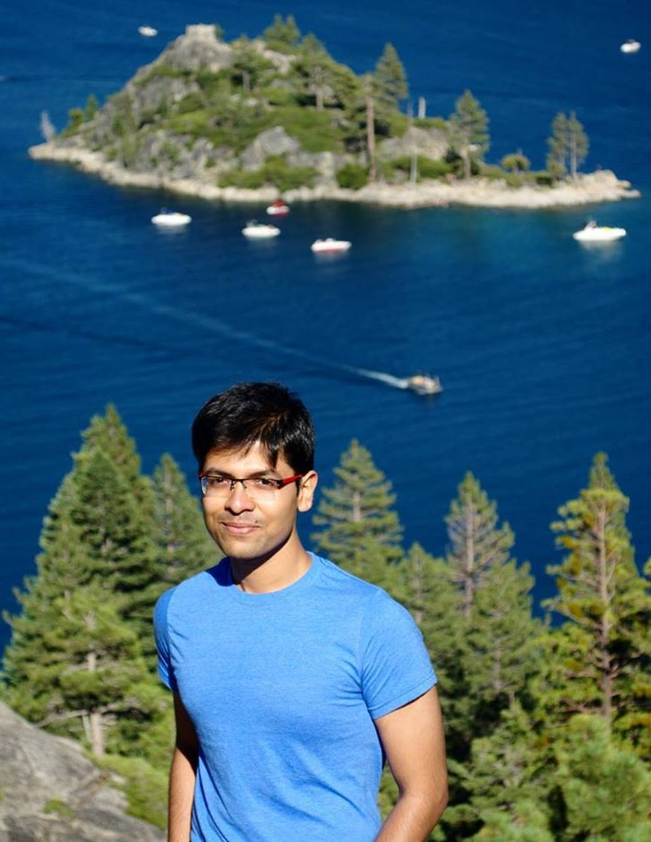

<h1 style='font-family: Lora;'>
  Saswat
  
  ADHI
</h1>

  
  

MS/PhD Graduate Student  
Advisor: [Professor Todd Millstein](Todd)  
PLSE Group, [CS Dept.](CS@UCLA), [UCLA]

3440 Boelter Hall,  
Los Angeles, CA 90095-1596

<i class="fa fa-skype"></i> saswat.padhi  
<i class="fa fa-envelope"></i> padhi <i class="fa fa-at"></i> cs &middot; ucla &middot; edu  
<i class="fa fa-github-alt"></i> [saswatpadhi](https://github.com/SaswatPadhi) &bull; <i class="fa fa-linkedin-square"></i> [saswatpadhi](https://www.linkedin.com/in/saswatpadhi)  

  

  

*[CS]:          Computer Science Department
*[UCLA]:        University of California - Los Angeles
*[PLSE]:        Programming Languages and Software Engineering

[Todd]:     http://web.cs.ucla.edu/~todd
[UCLA]:     http://ucla.edu
[CS@UCLA]:  http://cs.ucla.edu
